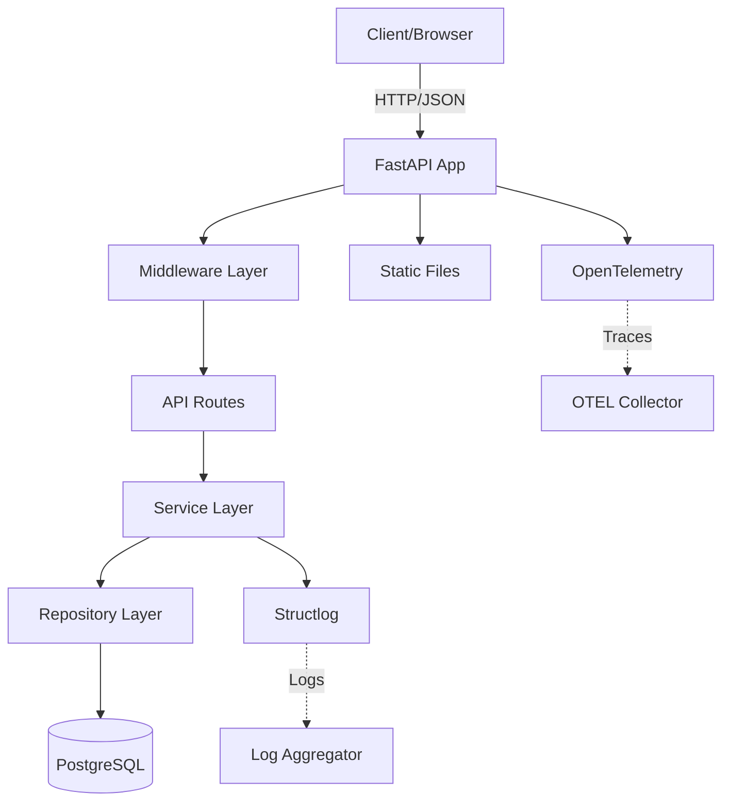
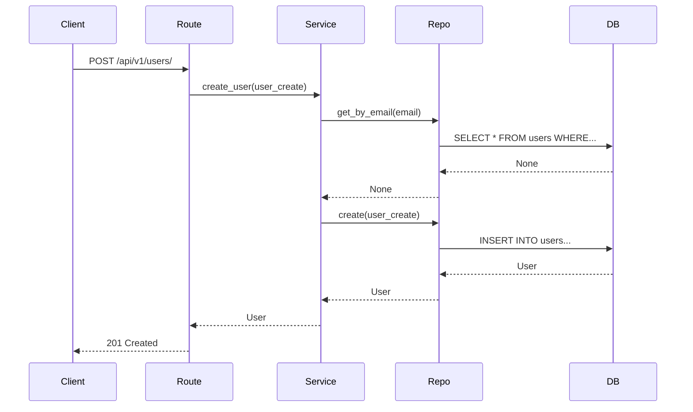
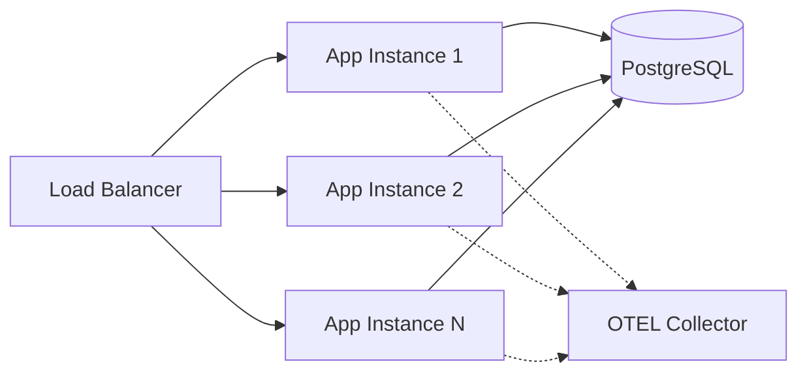
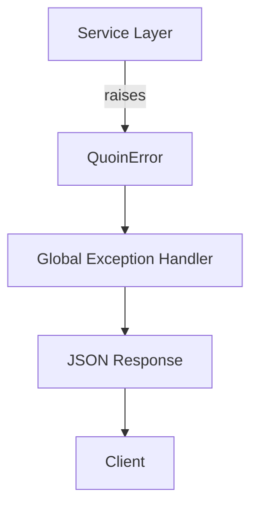

# Overview

Component structure, data flow, and integration patterns of the
QuoinAPI.

---

## High-Level Architecture



---

## Component Layers

### 1. Application Layer (`app/main.py`)

The application factory creates and configures the FastAPI application:

```python
def create_app() -> FastAPI:
    setup_logging()
    validate_production_settings()  # crash-loop a bad production config

    @asynccontextmanager
    async def lifespan(app: FastAPI):
        # Startup: DB engine, session factory, shared HTTP client
        yield
        # Shutdown: flip /ready to 503, drain in-flight requests, then
        # close the HTTP client and dispose the engine

    app = FastAPI(lifespan=lifespan, **OPENAPI_PARAMETERS)
    add_exception_handlers(app)
    configure_middlewares(app)
    setup_opentelemetry(app)
    app.mount("/static", StaticFiles(directory=...), name="static")
    app.include_router(api_router)  # everything under /api/v1
    app.include_router(system_router_root)  # /, /health, /ready
    return app
```

**Responsibilities:**

- Manage application lifecycle (startup, graceful shutdown)
- Fail fast on an incomplete production configuration
- Configure middlewares and exception handlers
- Set up observability (OTEL, logging)
- Mount static files
- Include API and system routes

---

### 2. Core Infrastructure (`app/core/`)

Shared infrastructure every feature module builds on. It is
template-owned: a module composes these rather than reimplementing
them, which is what keeps `copier update` diffs small.

| Module | Responsibility |
| :--- | :--- |
| [`config.py`](../api/core.md#configuration) | Typed settings from the environment, with a fail-fast production check |
| [`metadata.py`](../api/core.md#metadata) | App name, version, and OpenAPI descriptions |
| [`logging.py`](../api/core.md#logging) | Structlog pipeline; JSON in production, console elsewhere |
| [`exceptions.py`](../api/core.md#exceptions) | The `QuoinError` hierarchy every layer raises |
| [`schemas.py`](../api/core.md#schemas) | The `ProblemDetail` body errors render into |
| [`exception_handlers.py`](../api/core.md#exception-handlers) | Translates exceptions into RFC 9457 responses |
| [`middlewares.py`](../api/core.md#middlewares) | The request pipeline: security headers, request ID, access log, trusted hosts, CORS, timeout, size limit |
| [`security.py`](../api/core.md#security) | Token validation, `ServicePrincipal`, and `require_roles` |
| [`lifecycle.py`](../api/core.md#lifecycle) | In-flight tracking behind readiness and the shutdown drain |
| [`telemetry.py`](../api/core.md#telemetry) | OpenTelemetry tracing and OTLP export |
| [`pagination.py`](../api/core.md#pagination) | The `Page[T]` envelope and sort parsing |
| [`versioning.py`](../api/core.md#versioning) | RFC 8594 deprecation headers |
| [`openapi.py`](../api/core.md#openapi) | Schema generation, tags, and shared error responses |

Two ordering decisions shape how the rest behaves:

- **Middleware is registered innermost-first** (`add_middleware` is
  LIFO), so security headers and the request ID end up outermost and
  every manufactured error — 504, 413, 400, 500 — still carries them.
  The [security guide](../guides/security.md#middleware-ordering) has
  the full rationale.
- **Configuration is validated in `create_app()`**, not on import, so
  Alembic and the scripts stay decoupled from OAuth settings while a
  misconfigured production deploy still fails at startup.

The [Core reference](../api/core.md) documents what each module
provides.

---

### 3. Database Layer (`app/db/`)

#### Engine Creation (`session.py`)

```python
def create_db_engine(url: str | None = None) -> AsyncEngine:
    return create_async_engine(
        url or str(settings.DATABASE_URL),
        echo=False,
        pool_size=settings.DB_POOL_SIZE,
        max_overflow=settings.DB_MAX_OVERFLOW,
        pool_timeout=settings.DB_POOL_TIMEOUT,
        pool_recycle=settings.DB_POOL_RECYCLE,
        pool_pre_ping=settings.DB_POOL_PRE_PING,
    )
```

Every pool knob is a `QUOIN_DB_POOL_*` setting — see the
[configuration guide](../guides/configuration.md#key-settings).

Stored on `app.state.engine` during application lifespan.

#### Session Injection

```python
async def get_session(request: Request) -> AsyncSession:
    engine = request.app.state.engine
    async_session = async_sessionmaker(engine, ...)
    async with async_session() as session:
        yield session
        await session.commit()  # or rollback() on error
```

Routes depend on `SessionDep` (an `Annotated[AsyncSession,
Depends(get_session, scope="function")]` alias), not on `get_session`
directly. The explicit `scope="function"` matters: it's what makes
FastAPI close this generator — running the commit above — *before* the
response is sent, rather than after. Depending on `get_session` without
that scope commits the transaction after the client has already
received the response.

---

### 4. Feature Modules (`app/modules/`)

Each module follows **Domain-Driven Design** principles:

```
app/modules/user/
├── __init__.py       # Export router
├── models.py         # SQLModel tables
├── schemas.py        # Pydantic request/response
├── exceptions.py     # Domain-specific exceptions
├── repository.py     # Database operations (CRUD)
├── service.py        # Business logic
└── routes.py         # FastAPI endpoints
```

#### Data Flow



#### Layer Responsibilities

| Layer            | Responsibility                | Example                              |
| :--------------- | :---------------------------- | :----------------------------------- |
| **Routes**       | HTTP handling, validation     | `@router.post("/users/")`            |
| **Services**     | Business logic, orchestration | `if existing: raise ConflictError()` |
| **Repositories** | Database operations           | `session.execute(select(User))`      |
| **Models**       | Database schema               | `class User(SQLModel, table=True)`   |
| **Schemas**      | API contracts                 | `class UserCreate(BaseModel)`        |

---

## Template-Owned vs. User-Owned Files

QuoinAPI is also a Copier template, so every file falls on one side of a
line: **template-owned** files ship improvements to you on
`copier update`; **user-owned** files are yours and are never rewritten.

| Ownership | Files | On `copier update` |
| :--- | :--- | :--- |
| Template | `app/core/`, `app/db/`, `app/main.py`, `app/api.py`, `alembic/env.py`, `justfile`, `pyproject.toml`, `Dockerfile`, `.github/`, `.claude/`, `docs/guides/` | Updated; edits here are what produce merge conflicts |
| User | your `app/modules/<feature>/`, their tests, the migrations you generate, `.env`, your own docs | Left alone |
| Example | `app/modules/user/` and its tests | Template-owned, but meant to be deleted or rewritten once you have real modules |

Keeping your code in `app/modules/` is what keeps `copier update` diffs
small. See the [API stability guide](../guides/api-stability.md) for what
counts as a breaking template change.

---

## Request Lifecycle

1. **Client Request** → FastAPI receives HTTP request
2. **Middleware** → CORS, logging, tracing
3. **Router** → Matches URL pattern, validates input (Pydantic)
4. **Service** → Executes business logic, may raise domain exceptions
5. **Repository** → Queries/updates database via SQLModel
6. **Database** → PostgreSQL with asyncpg driver
7. **Response** → Service returns data, router serializes to JSON
8. **Exception Handling** → Global handlers catch `QuoinError` exceptions
9. **Logging & Tracing** → OTEL spans, structured logs emitted

---

## Database Schema

**Current Tables** (simplified; the migrations are the source of truth):

```sql
CREATE TABLE users (
    id UUID PRIMARY KEY,
    email VARCHAR(255) NOT NULL,
    full_name VARCHAR(255),
    is_active BOOLEAN NOT NULL,
    created_at TIMESTAMPTZ NOT NULL DEFAULT now(),
    updated_at TIMESTAMPTZ NOT NULL DEFAULT now(),
    deleted_at TIMESTAMPTZ  -- soft-delete tombstone
);

-- Case-insensitive uniqueness among live rows only
CREATE UNIQUE INDEX ix_users_email_lower
    ON users (lower(email)) WHERE deleted_at IS NULL;
```

See [Soft Delete](../guides/soft-delete.md) for why the unique index is
partial. Managed via **Alembic** migrations. Schema changes are versioned
and tracked in `alembic/versions/`.

---

## Static Files & Templates

```python
app.mount(
    "/static",
    StaticFiles(directory=Path(__file__).parent / "static"),
    name="static",
)
```

Serves:

- `app/static/css/` — Stylesheets
- `app/static/img/` — Images and icons
- `app/static/js/` — The home page's script, kept out of the HTML so the
  default CSP needs no `'unsafe-inline'` in `script-src`
- `app/templates/` — Jinja2 templates (root page)

---

## API Versioning

All API routes are versioned. The prefix is applied once, in
`app/api.py`; each module router declares only its own prefix
(`APIRouter(prefix="/users")`):

```python
v1_router = APIRouter()
v1_router.include_router(user_router)

api_router = APIRouter(prefix="/api/v1")
api_router.include_router(v1_router)
```

**URL Structure:** `/api/v{version}/{module}/{resource}`

Example: `/api/v1/users/` → User CRUD operations

---

## Deployment Architecture



**Characteristics:**

- **Stateless** application instances (horizontal scaling)
- **Shared** PostgreSQL database (connection pooling)
- **Centralized** observability (OTEL → Jaeger/Tempo)

---

## Concurrency Model

- **Async/Await** throughout the stack
- **asyncpg** for database I/O
- **AsyncSession** for SQLAlchemy operations
- **ResilientHTTPClient** (`httpx2`) for external API calls, with retries
  and a circuit breaker; see [Outbound HTTP](../guides/outbound-http.md)

```python
async def create_user(self, user_create: UserCreate) -> User:
    # Non-blocking database operations
    existing = await self.repository.get_by_email(user_create.email)
    if existing:
        raise ConflictError(message="Email already registered")
    return await self.repository.create(user_create)
```

Enables handling thousands of concurrent requests with minimal
resource usage.

---

## Error Handling Flow



All business logic errors are converted to HTTP responses
automatically. See [Error Handling Guide](../guides/error-handling.md)
for details.

---

## Testing Architecture

```
tests/
├── conftest.py           # Shared fixtures
├── core/                 # Settings, security, middleware, ...
└── modules/
    └── user/
        ├── test_routes.py       # Integration tests (routes → DB)
        └── test_concurrency.py  # Cross-transaction races
```

**Strategy:**

- **Integration tests** drive the full stack against a real PostgreSQL;
  each test rolls back to a SAVEPOINT
- **Focused tests** for models, exceptions, and core infrastructure
- Split out service or repository tests when a layer grows logic worth
  testing on its own

See [Testing Guide](../guides/testing.md) for patterns.

---

## Security Considerations

### Current Measures

1. **Input Validation** — Pydantic schema validation on all inputs
2. **SQL Injection Protection** — SQLAlchemy parameterized queries
3. **OAuth 2.0 / 2.1 Authentication** — JWT validation via JWKS with
   `require_roles()` per-route; `ServicePrincipal` identity injection
4. **CORS Configuration** — Allowlist-driven; no wildcard in production
5. **Trusted Hosts** — `Host` header allowlist; required in production
6. **Security Headers** — CSP, HSTS, `X-Frame-Options`, and friends on
   every response
7. **Request Limits** — Body-size cap (413) and per-request timeout (504)
8. **Environment Variables** — Secrets loaded from the environment or
   `.env` (not committed); the database password is a `SecretStr`
9. **Fail-fast Production Config** — the app refuses to boot without
   OAuth trust anchors and an explicit host allowlist

See the [Security guide](../guides/security.md) for each measure.

---

## Performance Optimizations

1. **Connection Pooling** — PostgreSQL connection pool (default size
   20, tunable with `QUOIN_DB_POOL_*`)
2. **Async I/O** — Non-blocking database and HTTP operations
3. **Database Indexes** — Indexed `users.email` for fast lookups
4. **Bounded Pagination** — list endpoints cap `limit` at 100

---

## See Also

- [Decision Log](decision-log.md) — Why we chose these technologies
- [Error Handling](../guides/error-handling.md) — Exception architecture
- [Database Migrations](../guides/database-migrations.md) — Schema management
- [Observability](../guides/observability.md) — Logging and tracing
