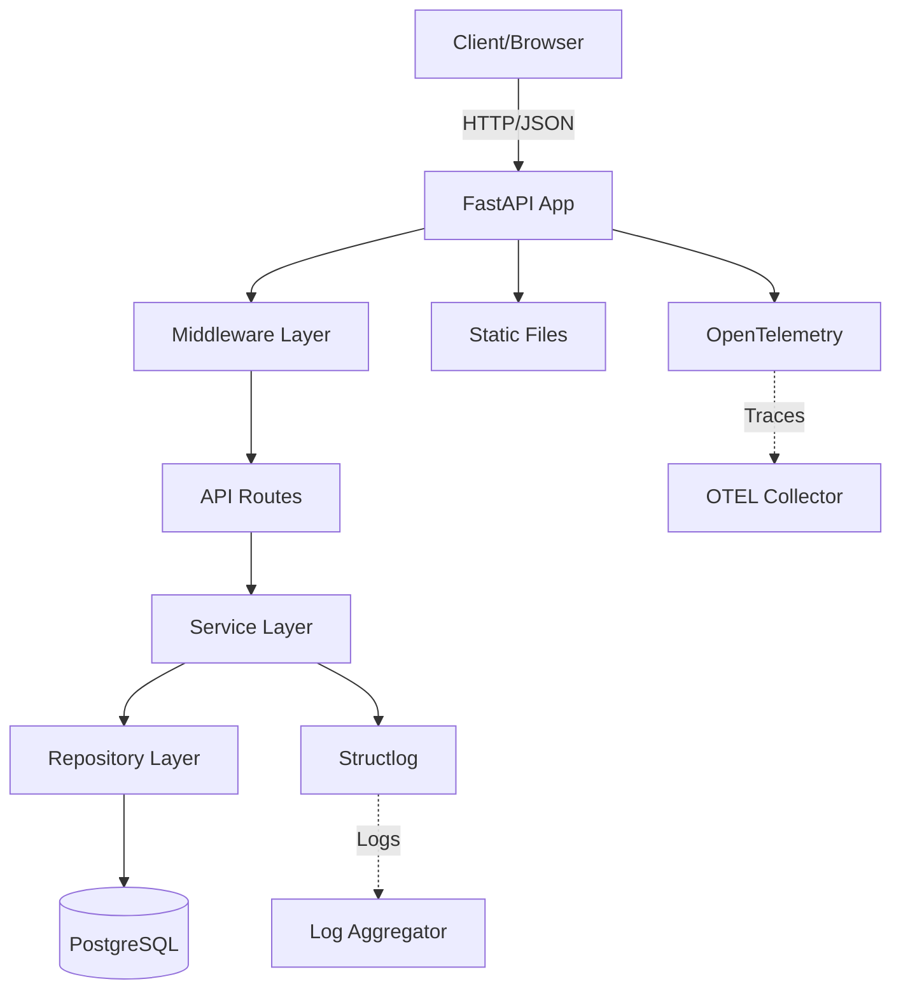

# Overview

How the pieces fit: the layers, what each owns, which files are the
template's and which are yours, and what happens to a request. Each
topic links to the guide that covers it in depth.

## High-Level Architecture

```mermaid
graph TB
    Client[Client/Browser] -->|HTTP/JSON| API[FastAPI App]
    API --> MW[Middleware Layer]
    MW --> Routes[API Routes]
    Routes --> Services[Service Layer]
    Services --> Repos[Repository Layer]
    Repos --> DB[(PostgreSQL)]

    API --> Static[Static Files]
    API --> OTEL[OpenTelemetry]
    Services --> Logger[Structlog]

    OTEL -.->|Traces| Collector[OTEL Collector]
    Logger -.->|Logs| Aggregator[Log Aggregator]
```

Instances are stateless and share one Postgres, so the app scales
horizontally behind a load balancer.

## Component Layers

### Application Layer (`app/main.py`)

`create_app()` builds the app in a fixed order: logging, the production
config check, exception handlers, middleware, telemetry, static files,
then the routers. Its lifespan creates the database engine, session
factory, and shared HTTP client on startup, and on shutdown flips
`/ready` to 503, drains in-flight requests, and only then closes them.

### Core Infrastructure (`app/core/`)

Shared infrastructure every feature module builds on. Modules compose
these rather than reimplementing them, which keeps `copier update` diffs
small.

| Module | Responsibility |
| :--- | :--- |
| [`config.py`](../api/core.md#configuration) | Typed settings from the environment, with a fail-fast production check |
| [`metadata.py`](../api/core.md#metadata) | App name, version, and OpenAPI descriptions |
| [`logging.py`](../api/core.md#logging) | Structlog pipeline; JSON in production, console elsewhere |
| [`exceptions.py`](../api/core.md#exceptions) | The `QuoinError` hierarchy every layer raises |
| [`schemas.py`](../api/core.md#schemas) | The `ProblemDetail` body errors render into |
| [`exception_handlers.py`](../api/core.md#exception-handlers) | Translates exceptions into RFC 9457 responses |
| [`middlewares.py`](../api/core.md#middlewares) | The request pipeline: security headers, request ID, access log, trusted hosts, CORS, timeout, size limit |
| [`security.py`](../api/core.md#security) | Token validation, `ServicePrincipal`, and `require_roles` |
| [`lifecycle.py`](../api/core.md#lifecycle) | In-flight tracking behind readiness and the shutdown drain |
| [`telemetry.py`](../api/core.md#telemetry) | OpenTelemetry tracing and OTLP export |
| [`pagination.py`](../api/core.md#pagination) | The `Page[T]` envelope and sort parsing |
| [`versioning.py`](../api/core.md#versioning) | RFC 8594 deprecation headers |
| [`openapi.py`](../api/core.md#openapi) | Schema generation, tags, and shared error responses |

Two ordering decisions shape how the rest behaves:

- **Middleware is registered innermost-first** (`add_middleware` is
  LIFO), so security headers and the request ID end up outermost and
  every manufactured error still carries them. See
  [Security](../guides/security.md#middleware-ordering).
- **Configuration is validated in `create_app()`**, not on import, so
  Alembic and the scripts stay decoupled from OAuth settings while a
  misconfigured production deploy still fails at startup.

### Database Layer (`app/db/`)

`create_db_engine()` builds an asyncpg engine whose pool is set by the
`QUOIN_DB_POOL_*` settings, stored on `app.state.engine`.
`get_session` yields one `AsyncSession` per request: repositories only
`flush()`, and the session commits when the request succeeds or rolls
back if anything raised, so a service touching several repositories
stays atomic.

Routes depend on `SessionDep`, which declares
`Depends(get_session, scope="function")`. That scope makes FastAPI run
the commit **before** the response is sent; without it the client could
see a success for a transaction that later fails to commit.

### Feature Modules (`app/modules/`)

Each module is a self-contained package with the same files, and each
layer calls only the one below it:

| Layer | Owns | Example |
| :--- | :--- | :--- |
| `routes.py` | HTTP: parsing, auth, status codes | `@router.post("/")` with `require_roles(...)` |
| `service.py` | Business rules; raises domain exceptions | `raise DuplicateEmailError(email)` |
| `repository.py` | Queries; no business logic | `select(User).where(...)` |
| `models.py` | The table | `class User(SQLModel, table=True)` |
| `schemas.py` | Request and response shapes | `class UserCreate(BaseModel)` |
| `exceptions.py` | The module's domain exceptions | `class UserNotFoundError(NotFoundError)` |

See [Creating a Module](../guides/creating-a-module.md) to build one.

## Template-Owned vs. User-Owned Files

QuoinAPI is also a Copier template, so every file falls on one side of a
line: **template-owned** files ship improvements to you on
`copier update`; **user-owned** files are yours and are never rewritten.

| Ownership | Files | On `copier update` |
| :--- | :--- | :--- |
| Template | `app/core/`, `app/db/`, `app/main.py`, `app/api.py`, `alembic/env.py`, `justfile`, `pyproject.toml`, `Dockerfile`, `.github/`, `.claude/`, `docs/guides/` | Updated; edits here are what produce merge conflicts |
| User | your `app/modules/<feature>/`, their tests, the migrations you generate, `.env`, your own docs | Left alone |
| Example | `app/modules/user/` and its tests | Template-owned, but meant to be deleted or rewritten once you have real modules |

Keeping your code in `app/modules/` is what keeps `copier update` diffs
small. See [API Stability](../guides/api-stability.md) for what counts
as a breaking template change.

## Request Lifecycle

1. **Middleware** — security headers, request ID, access log, host
   check, CORS, timeout, and size limit wrap the request.
2. **Routing** — the path matches a route under `/api/v1/`, prefixed
   once in `app/api.py`; Pydantic validates the input.
3. **Auth** — `require_roles()` validates the JWT and checks the role.
4. **Service and repository** — business rules run, and queries go
   through the request's session.
5. **Commit** — `get_session` commits before the response is sent.
6. **Errors** — any `QuoinError` becomes a problem details response
   through the global handlers; see
   [Error Handling](../guides/error-handling.md).
7. **Telemetry** — spans and structured logs share the request ID and
   trace ID; see [Observability](../guides/observability.md).

## Concurrency Model

Everything is async: routes, services, and repositories are
`async def`, the database driver is asyncpg, and outbound calls go
through the shared `ResilientHTTPClient`, with retries and a circuit
breaker (see [Outbound HTTP](../guides/outbound-http.md)). One process
serves many requests while each waits on I/O, so never call blocking
code from a route or service.

Concurrent writes to the same row are last-write-wins by default; see
[Optimistic Concurrency](../guides/optimistic-concurrency.md) to add
`ETag` / `If-Match` checks.

## See Also

- **Security measures** — [Security](../guides/security.md) and
  [Authentication](../guides/authentication.md)
- **Tests** — [Testing](../guides/testing.md)
- **Schema changes** — [Database Migrations](../guides/database-migrations.md);
  the migrations are the source of truth for the schema
- **Running it** — [Deployment](../guides/deployment.md)
- **Why these choices** — [Decision Log](decision-log.md)
