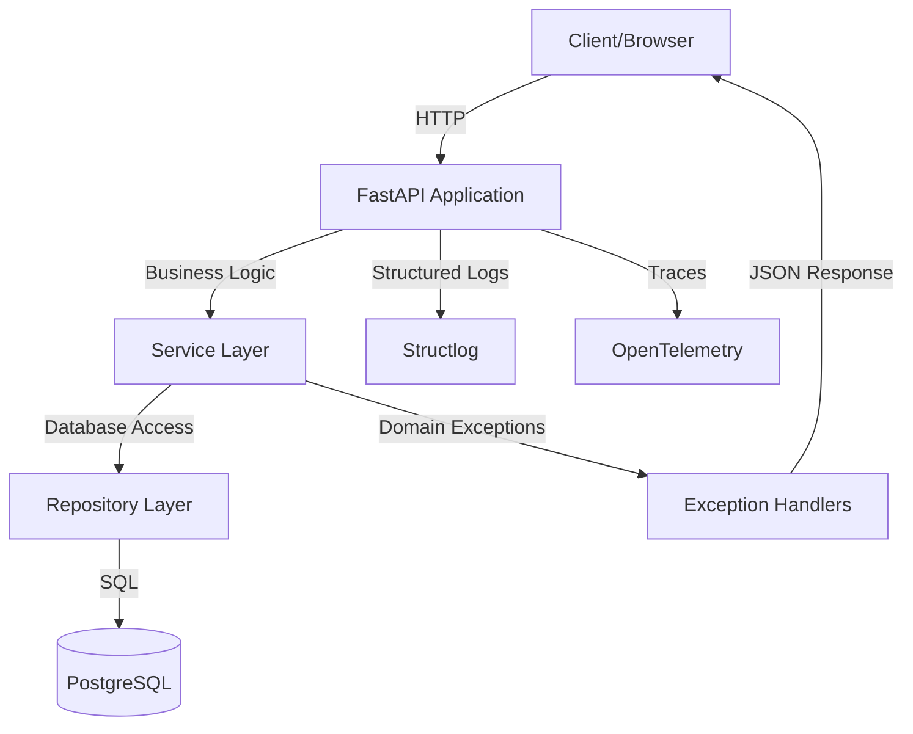

# QuoinAPI

[](https://github.com/balakmran/quoin-api/actions/workflows/ci.yml)
[](https://www.python.org/downloads/)
[](https://fastapi.tiangolo.com/)
[](https://sqlmodel.tiangolo.com/)
[](https://github.com/j178/prek)
[](https://opensource.org/licenses/MIT)

**QuoinAPI** (pronounced "koyn") is a high-performance, scalable foundation
for modern Python backends. Built with **FastAPI**, **SQLModel**, and the
**Astral stack** (uv, ruff, ty), it provides a battle-tested "Golden Path"
for developers who prioritize architectural integrity, type safety, and
observability.

New here? Start with the [Getting Started Guide](guides/getting-started.md).

## Quick Start

=== "Using Copier (recommended)"

    ```bash
    copier copy gh:balakmran/quoin-api my-api
    cd my-api
    cp .env.example .env
    just setup
    just dev
    ```

=== "Clone directly"

    ```bash
    git clone https://github.com/balakmran/quoin-api.git my-api
    cd my-api
    cp .env.example .env
    just setup
    just dev
    ```

Visit [http://localhost:8000/docs](http://localhost:8000/docs) for the
interactive API docs.

### Key recipes

| Command | What it does |
|---|---|
| `just setup` | Install deps and wire commit hooks — run once |
| `just dev` | Start Postgres, mock OAuth, apply migrations, and run the server |
| `just new <module>` | Scaffold a complete DDD module (models, schemas, repo, service, routes) |
| `just check` | Run format → lint → typecheck → test in one gate |
| `just migrate-gen "<msg>"` | Generate an Alembic migration from your model changes |
| `just token` | Mint a signed JWT against the local mock OAuth server |

!!! tip "Run `just --list` for the full menu."

## Architecture



Read the [full architecture documentation →](architecture/overview.md).

## Tech Stack

- **Framework:** FastAPI
- **Database:** PostgreSQL (using `asyncpg` driver)
- **ORM:** SQLModel (SQLAlchemy wrapper)
- **Migrations:** Alembic
- **Package Manager:** `uv`
- **Task Runner:** `just`
- **Linting/Formatting:** Ruff
- **Type Checking:** ty
- **Pre-commit Hooks:** prek
- **Testing:** Pytest, pytest-cov
- **Observability:** OpenTelemetry, Structlog
- **Documentation:** Zensical (MkDocs Material)

See the [decision log](architecture/decision-log.md) for the reasoning
behind these choices.

## Where next

- [Guides](guides/getting-started.md) — setup, development, operations
- [Architecture](architecture/overview.md) — system design and decisions
- [API Reference](api/overview.md) — module and endpoint documentation
- [Roadmap](project/roadmap.md) — what's planned and shipped
- [Contributing](project/contributing.md) — how to get involved
