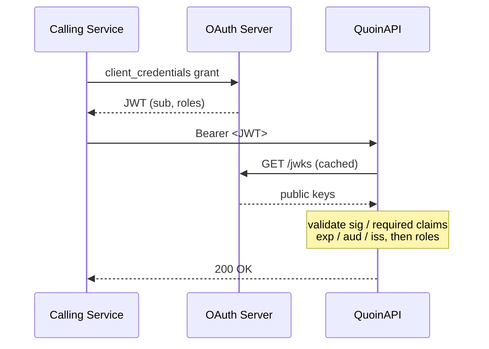

# Authentication

This guide covers QuoinAPI's OAuth 2.0 / 2.1 authentication system for
service-to-service API access.

---

## Overview

QuoinAPI uses **Bearer token authentication** based on the OAuth 2.0 Client
Credentials grant. There are no user sessions, cookies, or passwords. Every
API call is authenticated by validating a signed JWT issued by your
authorization server.

The security core is **provider-agnostic**: it works with any OIDC-compliant
server (Azure AD, Okta, Auth0, Keycloak) via standard JWKS discovery.

---

## Concepts

### ServicePrincipal

`ServicePrincipal` is the resolved identity of an authenticated calling
service — not a human user. It is built from validated JWT claims and
injected into every protected route by `require_roles()`.

```python
class ServicePrincipal(BaseModel):
    subject: str  # JWT `sub` — stable, unique service identifier
    roles: list[str]  # Normalized app roles from the token
    claims: dict[str, Any]  # Full decoded JWT payload (for advanced use)
```

`subject` maps to the OAuth 2.0 `sub` claim, which is stable and
provider-agnostic across Azure AD, Auth0, Okta, and Keycloak:

```json
{
  "sub": "xxxxxxxx-xxxx-xxxx-xxxx-xxxxxxxxxxxx",
  "roles": ["users.read"],
  "iss": "https://login.microsoftonline.com/{tenant}/v2.0",
  "aud": "api://your-app-client-id",
  "exp": 1713484800
}
```

Use `caller.subject` in structured logs for audit trails:

```python
logger.info(
    "resource.deleted",
    actor=caller.subject,
    resource_id=resource_id,
)
```

### App Roles (Domain Scoped)

Authorization is enforced via **app roles** embedded in the token.

QuoinAPI enforces **domain-scoped permissions** rather than global
read/write permissions. Scopes name a resource's bounded context, formatted
`[domain].[action]`, to follow the principle of least privilege.

| Role | Description | Protects |
| :--- | :--- | :--- |
| `users.read` | Read access to a domain | `GET /api/v1/users/` |
| `users.write` | Mutation access to a domain | `POST /api/v1/users/` |
| `api.superuser` | **Global Bypass** (opt-in) | *Local testing and master scripts* |

Routes declare which role they require via `require_roles(...)`. There is
no hidden baseline role, so every route documents its own access
requirement.

The bypass is **off by default**. `QUOIN_OAUTH_SUPERUSER_ENABLED=true`
turns it on, and the generated `.env` does so for local development.
Enabled in production, it logs `production_superuser_bypass_enabled`
at startup. The role name is a setting, `QUOIN_OAUTH_SUPERUSER_ROLE`:
if you enable the bypass and your IdP could issue a role literally
named `api.superuser` to callers who should not hold global authority,
rename it.

### Token Validation

Every request to a protected endpoint runs the following checks natively:

| Check | Source |
| :--- | :--- |
| Signature | JWKS from your OAuth server (cached with auto-rotation) |
| Required claims | `exp`, `iat`, `sub`, `aud`, `iss` must all be **present** |
| Expiry | `exp` claim, with 10 s of clock-skew leeway |
| Audience | `aud` == `QUOIN_OAUTH_AUDIENCE` |
| Issuer | `iss` == `QUOIN_OAUTH_ISSUER` |
| Subject | `sub` is non-empty after trimming |
| Role | `roles` contains the specifically requested `[domain].[action]` |

!!! warning "Presence is checked, not just validity"
    PyJWT verifies only the claims a token actually carries. Without
    `options["require"]`, a token minted with **no `exp`** would be
    accepted forever, and one with no `sub` would resolve to a
    `ServicePrincipal` with an empty subject. QuoinAPI therefore
    requires all five claims explicitly; a token missing any of them is
    a `401` naming the claim.

    If your IdP genuinely omits one — some legacy servers skip `iat` —
    adjust `_REQUIRED_CLAIMS` in `app/core/security.py`. Do not remove
    `exp`.

---

## Flow



---

## Configuration

Add the following to your `.env` file:

```bash
# OAuth 2.0 — required for authentication
QUOIN_OAUTH_JWKS_URI=https://login.microsoftonline.com/{tenant}/discovery/v2.0/keys
QUOIN_OAUTH_ISSUER=https://login.microsoftonline.com/{tenant}/v2.0
QUOIN_OAUTH_AUDIENCE=api://{your-app-client-id}

# Claim key — defaults work for Azure AD; adjust for other providers
QUOIN_OAUTH_ROLES_CLAIM=roles

# Global-bypass role; the bypass itself is off unless enabled
QUOIN_OAUTH_SUPERUSER_ROLE=api.superuser
QUOIN_OAUTH_SUPERUSER_ENABLED=false

# Backoff: min seconds between JWKS refetches for an unknown kid
QUOIN_OAUTH_JWKS_MIN_REFRESH_SECONDS=30.0

# Seconds a fetched key set is fresh before a background refresh
QUOIN_OAUTH_JWKS_TTL_SECONDS=3600
```

| Variable | Description | Default |
| :--- | :--- | :--- |
| `QUOIN_OAUTH_JWKS_URI` | JWKS endpoint (public signing keys) | `None` |
| `QUOIN_OAUTH_ISSUER` | Expected `iss` claim | `None` |
| `QUOIN_OAUTH_AUDIENCE` | Expected `aud` claim | `None` |
| `QUOIN_OAUTH_ROLES_CLAIM` | Claim key holding app roles | `roles` |
| `QUOIN_OAUTH_SUPERUSER_ROLE` | Role that bypasses every `require_roles()` check | `api.superuser` |
| `QUOIN_OAUTH_SUPERUSER_ENABLED` | Whether the bypass applies at all | `false` |
| `QUOIN_OAUTH_JWKS_MIN_REFRESH_SECONDS` | Min seconds between JWKS refetches triggered by an unknown `kid` | `30.0` |
| `QUOIN_OAUTH_JWKS_TTL_SECONDS` | Seconds a fetched key set is fresh; a stale set is still served while it refreshes in the background | `3600` |

!!! warning "All three trust anchors are required"
    `validate_token` rejects every request unless
    `QUOIN_OAUTH_JWKS_URI`, `QUOIN_OAUTH_ISSUER`, **and**
    `QUOIN_OAUTH_AUDIENCE` are set. Issuer is enforced explicitly
    because PyJWT silently skips `iss` verification when the expected
    issuer is `None`. In `production` these are validated at **startup**
    — a deployment missing any of them (or using a non-`https://` JWKS
    URI) crash-loops rather than serving 401s while looking healthy.

!!! note
    If your provider uses scopes instead of roles (e.g. Okta, Auth0
    M2M), set `QUOIN_OAUTH_ROLES_CLAIM=scope`. The validator handles
    both array (`["users.read"]`) and space-separated string
    (`"users.read users.write"`) formats automatically.

!!! tip
    The local `mock-oauth2-server` places roles in the `aud` claim, so
    the development `.env` uses `QUOIN_OAUTH_ROLES_CLAIM=aud`.
    Production IdPs (Azure AD, Auth0, Keycloak) use `roles` — the
    default value.

---

## Protecting Routes

Routes declare their own required roles explicitly using `require_roles()`.
There is no implicit baseline — every route self-documents its access
requirement.

### General Usage

```python
from typing import Annotated
from fastapi import APIRouter, Depends
from app.core.security import ServicePrincipal, require_roles

router = APIRouter()


# Read — any caller with users.read OR api.superuser
@router.get("/")
async def list_users(
    caller: Annotated[ServicePrincipal, Depends(require_roles("users.read"))],
): ...


# Write — any caller with users.write OR api.superuser
@router.post("/")
async def create_user(
    caller: Annotated[ServicePrincipal, Depends(require_roles("users.write"))],
): ...
```

---

## Dependency Graph

```
HTTPBearer()
    └── get_token_claims()        # Validates JWT, returns raw claims
            └── get_current_caller()  # Parses ServicePrincipal (no role check)
                    └── require_roles("users.read")   # Domain checks
```

---

## OAuth 2.1 Compatibility

QuoinAPI is compatible with both OAuth 2.0 and OAuth 2.1 for
service-to-service calls. The Client Credentials grant is **unchanged**
between the two specifications.

The key differences in OAuth 2.1 (implicit grant removal, PKCE requirement,
refresh token rotation) apply to **authorization servers** — not resource
servers like QuoinAPI. Your token validation code does not change.

---

## Local Testing & Tokens

For local development and testing, QuoinAPI provides two mechanisms.

### Layer 1 — The `mock-oauth2-server` stack

The integration testing layer. `mock-oauth2-server` runs as a Docker service
alongside the database, issuing real RS256 JWTs from a real JWKS endpoint.

```bash
just dev   # Starts DB + mock OAuth server + API natively
```

`scripts/gen_token.py` (run as `just token`) mints signed, valid tokens
against the mock server, so no real SSO is needed.

**Testing everything with the bypass token.** The local `.env` enables
the `api.superuser` bypass, so one token exercises every endpoint:

```bash
# Generate a master bypass token
just token --roles="api.superuser"
```

**Testing Explicit Constraints**:
If you want to ensure your `users.read` role is blocked from write endpoints:

```bash
# 1. Get a standard token strictly limited to `users.read`
TOKEN=$(just token --roles="users.read")

# 2. Call a protected Read endpoint (e.g. fetching users) -> 200 OK
curl -H "Authorization: Bearer $TOKEN" http://localhost:8000/api/v1/users/

# 3. Attempt to mutate (which requires `users.write`) -> 403 Forbidden
curl -X POST -H "Authorization: Bearer $TOKEN" \
  -H "Content-Type: application/json" \
  -d '{"email":"bad@caller.com", "full_name": "Eve"}' \
  http://localhost:8000/api/v1/users/
```

### Layer 2 — `dependency_overrides` natively in tests

The fast layer used by the automated test suite: no containers and no
tokens. Tests inject a pre-built `ServicePrincipal` through FastAPI's
dependency overrides:

```python
# tests/conftest.py — shared fixtures (already configured)
@pytest.fixture
def caller_read() -> ServicePrincipal:
    return ServicePrincipal(
        subject="test-service-read",
        roles=["users.read"],
        claims={},
    )
```

Use in tests:

```python
async def test_get_resource(read_client: AsyncClient) -> None:
    response = await read_client.get("/api/v1/users/")
    assert response.status_code == 200
```

---

## Error Responses

All error responses use `Content-Type: application/problem+json`
(RFC 9457). The `401` includes `WWW-Authenticate: Bearer` per RFC 6750.

| Status | When |
| :--- | :--- |
| `401 Unauthorized` | No token, malformed token or header, expired token, invalid signature |
| `403 Forbidden` | Valid token, but missing required role |

Example 401:

```json
{
  "type": "urn:quoin:error:unauthorized_error",
  "title": "Unauthorized",
  "status": 401,
  "detail": "Unauthorized",
  "instance": "/api/v1/users/"
}
```

Example 403:

```json
{
  "type": "urn:quoin:error:forbidden_error",
  "title": "Forbidden",
  "status": 403,
  "detail": "Forbidden",
  "instance": "/api/v1/users/"
}
```

---

## Testing

Route tests don't mint real tokens. `read_client` and `admin_client`
override the `get_current_caller` dependency with a fixed
`ServicePrincipal`, so a test exercises *your* authorization rules
without a JWKS round trip:

```python
async def test_create_user(admin_client: AsyncClient) -> None:
    """A caller holding users.write may create."""
    response = await admin_client.post(
        "/api/v1/users/", json={"email": "new@example.com"}
    )
    assert response.status_code == 201
```

The negative cases are the ones worth writing, and they're the ones
people skip. An authenticated caller without the role gets `403`, and
`anonymous_client` — a client carrying no credentials at all — gets
`401`:

```python
async def test_create_user_requires_write(read_client: AsyncClient) -> None:
    """A caller holding only users.read cannot create."""
    response = await read_client.post(
        "/api/v1/users/", json={"email": "denied@example.com"}
    )
    assert response.status_code == status.HTTP_403_FORBIDDEN


async def test_create_user_requires_a_token(
    anonymous_client: AsyncClient,
) -> None:
    """A missing token is 401, not 403."""
    response = await anonymous_client.post(
        "/api/v1/users/", json={"email": "anon@example.com"}
    )
    assert response.status_code == status.HTTP_401_UNAUTHORIZED
```

`anonymous_client` exists because the plain `client` fixture cannot
reach the 401 path. `get_token_claims` rejects a missing header before
it touches the HTTP client, but FastAPI resolves every dependency in
the signature first — and `get_http_client` raises unless the lifespan
ran, which it does not under `ASGITransport`. The fixture overrides
that one dependency so the rejection happens where it should.

Every protected route deserves all three: the allowed caller, the
under-privileged caller, and no caller at all. Distinguishing 401 from
403 matters — collapsing them tells an authenticated client to go and
re-authenticate, which will not help.

Token validation itself — JWKS fetching, key selection, malformed keys,
expiry — is already covered in `tests/core/test_security.py`. Don't
re-test it per route; test your role checks.

## See Also

- [Configuration Guide](configuration.md)
- [Error Handling Guide](error-handling.md)
- [app/core/security.py](https://github.com/balakmran/quoin-api/blob/main/app/core/security.py)
