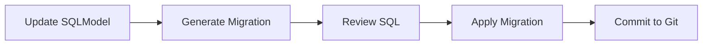
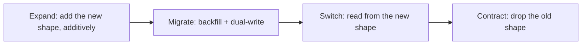

# Database Migrations

This guide explains how to manage database schema changes using Alembic,
the migration tool for SQLAlchemy and SQLModel.

---

## Overview

The application uses [Alembic](https://alembic.sqlalchemy.org/) to manage
database schema migrations. All schema changes must be defined as SQLModel
classes and captured in versioned migration scripts.

!!! warning
    **Never modify the database schema manually.** Always generate
    migrations from code changes.

---

## Workflow



---

## Creating Migrations

### 1. Update Your Models

Modify your SQLModel classes in `app/modules/*/models.py`:

```python
# app/modules/user/models.py
class User(SQLModel, table=True):
    __tablename__ = "users"

    id: uuid.UUID = Field(default_factory=uuid.uuid4, primary_key=True)
    email: str = Field(unique=True, index=True, max_length=255)
    full_name: str | None = Field(default=None, max_length=255)
    is_active: bool = Field(default=True)
    # NEW: Add a phone number field
    phone: str | None = Field(default=None, max_length=20)
```

### 2. Generate Migration Script

Use the `just migrate-gen` command with a descriptive message:

```bash
just migrate-gen "add phone field to users table"
```

This runs `alembic revision --autogenerate -m "message"` and creates a new
migration file in `alembic/versions/`:

```
alembic/versions/abc123def456_add_phone_field_to_users_table.py
```

Immediately afterwards, `migrate-gen` runs the **migration guard**
(`scripts/migration_guard.py`), which scans the new script and flags any
operation that is unsafe to apply to a live, populated database. See
[The migration guard](#the-migration-guard) below for what it catches and
how to respond.

### 3. Review the Generated SQL

**Always review the generated migration** before applying it:

```python
# alembic/versions/abc123def456_add_phone_field_to_users_table.py
def upgrade() -> None:
    op.add_column('users', sa.Column('phone', sa.String(length=20)))

def downgrade() -> None:
    op.drop_column('users', 'phone')
```

Common issues to check:

- Data loss operations (e.g., dropping columns with data)
- Missing NOT NULL constraints on new columns
- Index creation on large tables (consider `CONCURRENTLY`)
- Foreign key constraints

!!! note "SQLModel string columns"
    SQLModel `str` fields render as
    `sqlmodel.sql.sqltypes.AutoString(...)`. The `render_item` hook in
    [`alembic/env.py`](https://github.com/balakmran/quoin-api/blob/main/alembic/env.py)
    automatically adds the matching `import sqlmodel.sql.sqltypes` to any
    migration that needs it, so generated scripts apply cleanly. You do
    not need to add this import by hand.

### 4. Apply the Migration

```bash
just migrate-up
```

This runs `alembic upgrade head` to apply all pending migrations.

### 5. Commit to Git

```bash
git add alembic/versions/abc123def456_*.py
git commit -m "feat(user): add phone field to user model"
```

---

## Alembic Commands

All commands are wrapped in the [`justfile`](https://github.com/balakmran/quoin-api/blob/main/justfile):

| Command                  | Alembic Equivalent                         | Description                  |
| :----------------------- | :----------------------------------------- | :--------------------------- |
| `just migrate-gen "msg"` | `alembic revision --autogenerate -m "msg"` | Generate migration           |
| `just migrate-up`        | `alembic upgrade head`                     | Apply all pending migrations |
| `just migrate-down`      | `alembic downgrade -1`                     | Rollback last migration      |
| `just reset-db`          | (stop, restart, apply)                     | Reset database completely    |

!!! note
    `migrate-history` and `migrate-current` are not wrapped in `just`.
    Run Alembic directly for these:

    ```bash
    uv run alembic history         # Show migration history
    uv run alembic current         # Show current revision
    ```

---

## Configuration

Alembic configuration is stored in [`alembic.ini`](https://github.com/balakmran/quoin-api/blob/main/alembic.ini)
and [`alembic/env.py`](https://github.com/balakmran/quoin-api/blob/main/alembic/env.py).

### Database URL

The database URL is automatically loaded from environment variables via
`Settings.DATABASE_URL`:

```python
# alembic/env.py
from app.core.config import settings

config.set_main_option("sqlalchemy.url", str(settings.DATABASE_URL))
```

### SQLModel Metadata

All SQLModel tables are automatically discovered:

```python
# alembic/env.py
from sqlmodel import SQLModel
from app.modules.user.models import User  # Import all models

target_metadata = SQLModel.metadata
```

---

## Best Practices

### Naming Migrations

Use descriptive names that explain **what** changed:

```bash
✅ just migrate-gen "add email verification fields"
✅ just migrate-gen "create orders table"
✅ just migrate-gen "add index on user email"

❌ just migrate-gen "update database"
❌ just migrate-gen "changes"
```

### Handling Data Migrations

For operations that require data transformation, use **two-step migrations**:

**Step 1**: Add new column as nullable

```python
def upgrade() -> None:
    op.add_column('users', sa.Column('email_verified', sa.Boolean(), nullable=True))
```

**Step 2**: Backfill data and add NOT NULL constraint

```python
def upgrade() -> None:
    # Backfill data
    op.execute("UPDATE users SET email_verified = false WHERE email_verified IS NULL")
    # Add constraint
    op.alter_column('users', 'email_verified', nullable=False)
```

### Complex Migrations

For complex changes, manually edit the generated migration:

```python
def upgrade() -> None:
    # Create new table
    op.create_table('user_profiles',
        sa.Column('id', sa.UUID(), primary_key=True),
        sa.Column('user_id', sa.UUID(), nullable=False),
        sa.ForeignKeyConstraint(['user_id'], ['users.id'], ondelete='CASCADE'),
    )

    # Migrate data from old structure
    op.execute("""
        INSERT INTO user_profiles (id, user_id, ...)
        SELECT gen_random_uuid(), id, ... FROM users
    """)
```

---

## Zero-Downtime Migrations

In production the new application version and the old one overlap: during a
rolling deploy, both run against the **same database** for a window of
seconds to minutes. A migration is zero-downtime only if the schema is
compatible with *both* versions throughout that window. The single rule
that follows from this:

!!! danger "The overlap rule"
    A migration must never break the application version that is **still
    running**. Anything that drops, renames, narrows, or hard-constrains a
    column the old code still touches will cause errors mid-deploy.

The discipline that satisfies the rule is **expand/contract** (also called
parallel-change).

### The expand/contract pattern

Split every breaking schema change across **multiple deploys** so the
database is always compatible with the code on either side of a rollout:



1. **Expand** — Add the new column/table/index. Make it **additive and
   nullable**; never remove or tighten anything yet. Safe to apply while
   old code runs because old code ignores it.
2. **Migrate** — Backfill existing rows and have the new code **dual-write**
   (write both old and new shapes). Deploy this code.
3. **Switch** — Move reads to the new shape. Deploy. The old shape is now
   unused but still present.
4. **Contract** — In a *later* release, once no running code touches the
   old shape, drop it (and add any NOT NULL / constraints the new shape
   needs).

Each step is its own PR and its own deploy. The contract step is the only
destructive one, and by the time it runs nothing depends on what it drops.

### Recipes for common changes

#### Rename a column (`old_name` → `new_name`)

A rename is a drop + add to Postgres — never autogenerate it directly.

1. **Expand**: add `new_name` as nullable. `op.add_column(...)`.
2. **Migrate**: backfill `UPDATE t SET new_name = old_name`; deploy code
   that writes both.
3. **Switch**: deploy code that reads `new_name`.
4. **Contract**: `op.drop_column("t", "old_name")`.

#### Drop a column

1. **Expand/Switch**: deploy code that no longer reads or writes the
   column. (No schema change yet.)
2. **Contract**: `op.drop_column(...)` in the next release.

#### Change a column type

1. **Expand**: add a new column of the target type, nullable.
2. **Migrate**: backfill with a safe cast; dual-write.
3. **Switch**: read the new column.
4. **Contract**: drop the old column.

   In-place `ALTER COLUMN ... TYPE` may rewrite the whole table under an
   `ACCESS EXCLUSIVE` lock and can silently truncate on narrowing — avoid
   it on large or hot tables.

#### Add a NOT NULL column

`ADD COLUMN ... NOT NULL` without a default **fails** on a populated table.

1. **Expand**: add it nullable, or with a `server_default`.

   ```python
   op.add_column(
       "users",
       sa.Column("status", sa.String(), server_default="active"),
   )
   ```

2. **Migrate**: backfill any remaining `NULL`s.
3. **Contract**: `op.alter_column("users", "status", nullable=False)` once
   every row has a value.

#### Add an index

Plain `CREATE INDEX` takes a write lock for the duration of the build. On
Postgres, build it concurrently instead:

```python
def upgrade() -> None:
    op.create_index(
        "ix_users_created_at", "users", ["created_at"],
        postgresql_concurrently=True,
    )
```

!!! warning "CONCURRENTLY needs a non-transactional migration"
    `CREATE INDEX CONCURRENTLY` cannot run inside a transaction. Set
    `# revision = ...` aside and disable the per-migration transaction for
    that script (`op.get_context().autocommit_block()` or run it as a
    standalone migration), or the build will error.

### The migration guard

`just migrate-gen` runs `scripts/migration_guard.py` against the script it
just generated and prints **advisory** flags for unsafe operations. It is
non-blocking — it never stops the workflow; it surfaces what to review.

It parses the migration's AST — so multi-line calls are matched as whole
statements, and operations nested inside an `op.batch_alter_table(...)`
block are caught too — and flags:

| Operation | Why it's flagged |
| :-------- | :--------------- |
| `drop_column` / `drop_table` | Irreversible data loss; contract-phase only |
| `drop_constraint` | May break invariants the running app relies on |
| `alter_column(..., type_=...)` | Table rewrite under lock; data loss on narrowing |
| `alter_column(..., nullable=False)` | Table scan/lock; fails on existing `NULL`s |
| `add_column(..., nullable=False)` without a real `server_default` | Fails on a populated table |
| `create_index` / `drop_index` without `postgresql_concurrently=True` | Takes a blocking lock |
| `op.execute(...)` with a `DELETE FROM`, `TRUNCATE`, or `DROP <object>` statement | Destructive raw SQL |

Operation rows match calls on `op` and on the variable bound by a
`batch_alter_table` block (conventionally `batch_op`).

It deliberately does **not** flag the safe escape hatches: a column added
with a real `server_default` (an explicit `server_default=None` is treated
as *no* default and is still flagged), an index built
`postgresql_concurrently=True`, or Alembic's `existing_nullable=False`
context on a type change. Commented-out operations — and `DROP` / `DELETE` /
`TRUNCATE` appearing only inside string data, such as `'Drop-off point'` —
are ignored.

A flag is a prompt, not a verdict. If you intend the change and have a
maintenance window (or the table is small and empty), proceed. Otherwise
split it into an expand/contract sequence using the recipes above. You can
re-run the guard manually on any script:

```bash
uv run python scripts/migration_guard.py alembic/versions/<file>.py
```

---

## Production Deployments

### Option 1: Run Migrations in Dockerfile

```dockerfile
# Add to Dockerfile
COPY alembic/ alembic/
COPY alembic.ini .

# Run migrations on container start
CMD ["sh", "-c", "alembic upgrade head && uvicorn app.main:app --host 0.0.0.0"]
```

### Option 2: Separate Migration Job

Run migrations as a separate one-off job before deploying:

```bash
# Kubernetes Job
kubectl run migrations --image=myapp:latest --command -- alembic upgrade head

# Docker Compose
docker-compose run app alembic upgrade head
```

---

## Rollback Strategy

### Rolling Back Migrations

```bash
# Rollback last migration
just migrate-down

# Rollback to specific revision
uv run alembic downgrade abc123def456
```

### Testing Rollbacks

Always test that `downgrade()` works:

```bash
# Test upgrade/downgrade cycle
just migrate-up
just migrate-down
just migrate-up
```

---

## Troubleshooting

### "Target database is not up to date"

```
FAILED: Target database is not up to date.
```

**Solution**: Apply pending migrations first:

```bash
just migrate-up
```

### "Can't locate revision identified by 'xyz'"

**Solution**: The migration history is out of sync. Check:

```bash
# What migrations exist in code?
ls alembic/versions/

# What revision is the database at?
uv run alembic current
```

### Autogenerate Doesn't Detect Changes

Common causes:

1. **Model not imported** in `alembic/env.py`
2. **Schema change not saved** — ensure you've saved the model file before
   running autogenerate
3. **SQLModel metadata not set** as target_metadata

**Solution**: Add import to [`alembic/env.py`](https://github.com/balakmran/quoin-api/blob/main/alembic/env.py):

```python
from app.modules.user.models import User
from app.modules.product.models import Product  # Add new models here
```

### "NameError: name 'sqlmodel' is not defined"

A migration that adds or alters a SQLModel `str` column references
`sqlmodel.sql.sqltypes.AutoString(...)` and fails on `just migrate-up`.

**Solution**: This is handled automatically by the `render_item` hook in
[`alembic/env.py`](https://github.com/balakmran/quoin-api/blob/main/alembic/env.py),
which emits the required `import sqlmodel.sql.sqltypes`. If you hit this,
your `env.py` predates the hook — re-add it, or add the import to the
affected migration by hand.

---

## Quick Reference

| Task                         | Command                        |
| ---------------------------- | ------------------------------ |
| Generate migration           | `just migrate-gen "message"`   |
| Apply migrations             | `just migrate-up`              |
| Rollback one step            | `just migrate-down`            |
| View history                 | `uv run alembic history`       |
| View current revision        | `uv run alembic current`       |
| Stamp head (without running) | `uv run alembic stamp head`    |

---

## See Also

- [Alembic Documentation](https://alembic.sqlalchemy.org/)
- [SQLModel Documentation](https://sqlmodel.tiangolo.com/)
- [alembic/env.py](https://github.com/balakmran/quoin-api/blob/main/alembic/env.py) — Migration configuration
