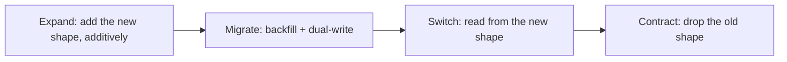

# Database Migrations

Every schema change starts in a SQLModel class and ships as a reviewed
[Alembic](https://alembic.sqlalchemy.org/) script. Never change the
schema by hand. This page covers the everyday loop, then how to change a
live table without downtime.

## Workflow

1. **Change the model** in `app/modules/<module>/models.py`, for example
   `phone: str | None = Field(default=None, max_length=20)`.
2. **Generate the script:**

   ```bash
   just migrate-gen "add phone to users"
   ```

   Name the change, not the act: "create orders table", not "update
   database". `migrate-gen` then runs
   [the migration guard](#the-migration-guard) over the new file.

3. **Read the script** in `alembic/versions/`. Autogenerate can't tell a
   rename from a drop plus an add, and it doesn't know your table is
   large. Check that `downgrade()` reverses `upgrade()`.
4. **Apply it** with `just migrate-up`, and commit the script with the
   model change.

SQLModel `str` columns render as `sqlmodel.sql.sqltypes.AutoString`; the
`render_item` hook in `alembic/env.py` adds that import for you.

### Commands

| Command | Does |
| :--- | :--- |
| `just migrate-gen "msg"` | `alembic revision --autogenerate`, then the guard |
| `just migrate-up` | `alembic upgrade head` |
| `just migrate-down` | `alembic downgrade -1` |
| `just migrate-check` | Upgrade, then `alembic check`; fails on model drift |
| `just reset-db` | Recreate the database and apply every migration |
| `uv run alembic history` / `current` | Show the chain, or the database's revision |

`just migrate-check` runs inside `just check`, so a model change with no
migration, down to a changed index or server default, fails the gate.

### Registering models

Alembic sees only tables on `SQLModel.metadata`. `alembic/env.py`
imports `app/db/base.py`, and that file imports each module's models.
`just new <module>` does not add the import; add it yourself (see
[Creating a Module](creating-a-module.md#10-import-the-model-for-migrations)).
The database URL comes from `settings.DATABASE_URL`.

## Zero-Downtime Migrations

During a rolling deploy the old and new app versions run against the
**same database** for seconds to minutes, so the schema must suit both.

!!! danger "The overlap rule"
    A migration must never break the application version that is **still
    running**. Anything that drops, renames, narrows, or hard-constrains a
    column the old code still touches will cause errors mid-deploy.

### The expand/contract pattern

Split every breaking change across **several deploys**, so the database
always suits the code on both sides of a rollout:


```mermaid
graph LR
    A[Expand: add the new shape, additively] --> B[Migrate: backfill + dual-write]
    B --> C[Switch: read from the new shape]
    C --> D[Contract: drop the old shape]
```

1. **Expand** — Add the new column/table/index. Make it **additive and
   nullable**; never remove or tighten anything yet. Safe to apply while
   old code runs because old code ignores it.
2. **Migrate** — Backfill existing rows and have the new code **dual-write**
   (write both old and new shapes). Deploy this code.
3. **Switch** — Move reads to the new shape. Deploy. The old shape is now
   unused but still present.
4. **Contract** — In a *later* release, once no running code touches the
   old shape, drop it (and add any NOT NULL / constraints the new shape
   needs).

Each step is its own PR and its own deploy. The contract step is the only
destructive one, and by the time it runs nothing depends on what it drops.

### Recipes for common changes

#### Rename a column (`old_name` → `new_name`)

A rename is a drop + add to Postgres — never autogenerate it directly.

1. **Expand**: add `new_name` as nullable. `op.add_column(...)`.
2. **Migrate**: backfill `UPDATE t SET new_name = old_name`; deploy code
   that writes both.
3. **Switch**: deploy code that reads `new_name`.
4. **Contract**: `op.drop_column("t", "old_name")`.

#### Drop a column

1. **Expand/Switch**: deploy code that no longer reads or writes the
   column. (No schema change yet.)
2. **Contract**: `op.drop_column(...)` in the next release.

#### Change a column type

1. **Expand**: add a new column of the target type, nullable.
2. **Migrate**: backfill with a safe cast; dual-write.
3. **Switch**: read the new column.
4. **Contract**: drop the old column.

   In-place `ALTER COLUMN ... TYPE` may rewrite the whole table under an
   `ACCESS EXCLUSIVE` lock and can silently truncate on narrowing — avoid
   it on large or hot tables.

#### Add a NOT NULL column

`ADD COLUMN ... NOT NULL` without a default **fails** on a populated table.

1. **Expand**: add it nullable, or with a `server_default`.

   ```python
   op.add_column(
       "users",
       sa.Column("status", sa.String(), server_default="active"),
   )
   ```

2. **Migrate**: backfill any remaining `NULL`s.
3. **Contract**: `op.alter_column("users", "status", nullable=False)` once
   every row has a value.

#### Add an index

Plain `CREATE INDEX` takes a write lock for the duration of the build. On
Postgres, build it concurrently instead:

```python
def upgrade() -> None:
    op.create_index(
        "ix_users_created_at",
        "users",
        ["created_at"],
        postgresql_concurrently=True,
    )
```


`CREATE INDEX CONCURRENTLY` can't run inside a transaction, so wrap the
call in `with op.get_context().autocommit_block():`, or the migration
errors.

### The migration guard

`just migrate-gen` runs `scripts/migration_guard.py` on the new script
and prints advisory flags; it never blocks. It reads the script's AST,
so multi-line calls and operations inside `op.batch_alter_table(...)`
are caught too.

| Operation | Why it's flagged |
| :-------- | :--------------- |
| `drop_column` / `drop_table` | Irreversible data loss; contract-phase only |
| `drop_constraint` | May break invariants the running app relies on |
| `alter_column(..., type_=...)` | Table rewrite under lock; data loss on narrowing |
| `alter_column(..., nullable=False)` | Table scan/lock; fails on existing `NULL`s |
| `add_column(..., nullable=False)` without a real `server_default` | Fails on a populated table |
| `create_index` / `drop_index` without `postgresql_concurrently=True` | Takes a blocking lock |
| `op.execute(...)` with a `DELETE FROM`, `TRUNCATE`, or `DROP <object>` statement | Destructive raw SQL |
| `op.execute(...)` with an `UPDATE ... SET` and no `WHERE` | Rewrites every row on a large table |

The safe forms aren't flagged: a real `server_default` (an explicit
`server_default=None` still is), `postgresql_concurrently=True`, and
`existing_nullable=False` on a type change. Commented-out code and SQL
keywords inside string data are ignored.

A flag is a prompt, not a verdict. On a small or empty table, or with a
maintenance window, go ahead; otherwise split the change using the
recipes above. Re-run the guard on any script with:

```bash
uv run python scripts/migration_guard.py alembic/versions/<file>.py
```

## Production Deployments

The image contains `alembic/` and `alembic.ini` but doesn't run them on
start. Run them as a one-off job from the same image before rolling out,
so only one process migrates however many replicas follow:

```bash
kubectl run migrations --image=quoin-api:latest --command -- alembic upgrade head
docker run --rm --env-file production.env quoin-api:latest alembic upgrade head
```

Running `alembic upgrade head` in the container's start command is
simpler for a single instance, but every replica races to migrate.

To roll back, `just migrate-down` steps back once and
`uv run alembic downgrade <revision>` goes to a given revision. The test
suite runs every `downgrade()` at teardown, so a rollback that doesn't
work fails `just check` first.

## Testing

You don't write tests for your migrations; the suite runs them.
`initialize_db` builds the test schema with `alembic upgrade head` and
tears it down with `downgrade base`. So a model change with no migration
fails the suite, and so does a `downgrade()` that doesn't reverse its
`upgrade()`. `just check` adds `alembic check` for finer drift.

What's left to you is the **data** a migration moves. A schema-only
migration needs no test; a backfill, type change, or computed default
does. Seed rows in the old shape, run the upgrade, and assert the new
shape, including rows that were `NULL`, empty, or already correct.

## Troubleshooting

### "Target database is not up to date"

The database is behind the code. Run `just migrate-up`.

### "Can't locate revision" or multiple heads

Two branches each added a migration off the same parent, or the database
is stamped with a revision this checkout doesn't have. Compare:

```bash
uv run alembic heads    # more than one line means two heads
uv run alembic current
```

For two heads, point one migration's `down_revision` at the other if it
hasn't been applied anywhere; otherwise join them with
`uv run alembic merge -m "merge heads" <rev1> <rev2>`. Never delete a
migration that a shared database has applied.

### Autogenerate Doesn't Detect Changes

The model isn't imported in `app/db/base.py`, so it isn't on
`SQLModel.metadata`. Add the import (see
[Registering models](#registering-models)).

### "NameError: name 'sqlmodel' is not defined"

Your `alembic/env.py` predates the `render_item` hook that adds
`import sqlmodel.sql.sqltypes`. Restore the hook, or add the import to
the affected migration by hand.

## See Also

- [Creating a Module](creating-a-module.md) — where a new model comes
  from
- [Deployment](deployment.md) — rolling out alongside a migration
- [Alembic Documentation](https://alembic.sqlalchemy.org/)
