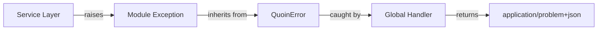

# Error Handling

This guide explains the error handling architecture in QuoinAPI,
including custom domain exceptions, module-level exceptions, global
exception handlers, and best practices for error management.

## Exception Quick Reference

| Exception                     | Status | Use Case                                  |
| :---------------------------- | :----: | :---------------------------------------- |
| `BadRequestError`             | 400    | Invalid request data or parameters        |
| `UnauthorizedError`           | 401    | Missing or invalid Bearer token           |
| `ForbiddenError`              | 403    | Insufficient permissions                  |
| `NotFoundError`               | 404    | Resource not found                        |
| `ConflictError`               | 409    | Resource conflict (e.g., duplicate email) |
| `QuoinRequestValidationError` | 422    | Pydantic validation errors (internal)     |
| `InternalServerError`         | 500    | Unexpected server errors                  |
| `BadGatewayError`             | 502    | Upstream returned an invalid response      |
| `ServiceUnavailableError`     | 503    | Required dependency unreachable           |
| `GatewayTimeoutError`         | 504    | Request exceeded the configured timeout   |

All inherit from `QuoinError`. Import from `app.core.exceptions`.

---

## Error Response Format (RFC 9457)

All errors return `Content-Type: application/problem+json` with a
[RFC 9457](https://www.rfc-editor.org/rfc/rfc9457) Problem Details
body:

```json
{
  "type": "urn:quoin:error:not_found_error",
  "title": "Not Found",
  "status": 404,
  "detail": "User with ID 'f47ac10b' not found",
  "instance": "/api/v1/users/f47ac10b"
}
```

| Field      | Description                                            |
| :--------- | :----------------------------------------------------- |
| `type`     | URN identifying the problem type (machine-readable)    |
| `title`    | Standard HTTP reason phrase for the status code        |
| `status`   | HTTP status code (mirrors the response status)         |
| `detail`   | Human-readable explanation of this specific occurrence |
| `instance` | Request path where the error occurred                  |
| `errors`   | Per-field array; only present on 422 responses         |

### type URN convention

`type` is derived automatically from the exception class name:

```
urn:quoin:error:<snake_case_class_name>
```

Examples: `NotFoundError` → `urn:quoin:error:not_found_error`,
`DuplicateEmailError` → `urn:quoin:error:duplicate_email_error`.

### Validation errors (422)

Validation errors include an `errors` array (RFC 9457 extension):

```json
{
  "type": "urn:quoin:error:validation_error",
  "title": "Unprocessable Content",
  "status": 422,
  "detail": "Request validation failed",
  "instance": "/api/v1/users/",
  "errors": [
    {
      "type": "string_type",
      "loc": ["body", "email"],
      "msg": "Input should be a valid string",
      "input": 42,
      "url": "https://errors.pydantic.dev/..."
    }
  ]
}
```

---

## Architecture Overview

The application uses a **module-level exception** pattern where
business logic errors are represented by custom exception classes that
extend core `QuoinError` classes. These exceptions are automatically
caught by global handlers and converted to RFC 9457 responses.



---

## Exception Hierarchy

All application exceptions inherit from
[`QuoinError`](https://github.com/balakmran/quoin-api/blob/main/app/core/exceptions.py):

```python
from app.core.exceptions import QuoinError

class QuoinError(Exception):
    """Base exception for all Quoin application errors."""

    def __init__(
        self,
        message: str,
        status_code: int = 500,
        headers: dict[str, str] | None = None,
    ) -> None:
        super().__init__(message)
        self.message = message
        self.status_code = status_code
        self.headers = headers
```

### Built-in Core Exception Classes

| Exception                     | Status Code | Use Case                                  |
| :---------------------------- | :---------- | :---------------------------------------- |
| `BadRequestError`             | 400         | Invalid request data or parameters        |
| `UnauthorizedError`           | 401         | Missing or invalid Bearer token           |
| `ForbiddenError`              | 403         | Insufficient permissions                  |
| `NotFoundError`               | 404         | Resource not found                        |
| `ConflictError`               | 409         | Resource conflict (e.g., duplicate email) |
| `QuoinRequestValidationError` | 422         | Pydantic validation errors                |
| `InternalServerError`         | 500         | Unexpected server errors                  |
| `ServiceUnavailableError`     | 503         | Required dependency unreachable           |
| `GatewayTimeoutError`         | 504         | Request exceeded the configured timeout   |

!!! tip "503 vs 500"
    Use `ServiceUnavailableError` when a required external dependency
    (database, cache, downstream API) is unreachable and the request
    cannot be retried locally. Use `InternalServerError` for unexpected
    failures within your own code. The distinction matters for callers:
    503 signals "retry later", 500 signals "something is broken here".

---

## Request Timeouts

`TimeoutMiddleware` enforces a per-request wall-clock limit using an
`anyio` cancel scope. If a request takes longer than the configured
limit, the middleware cancels it and returns a 504 RFC 9457 response:

```json
{
  "type": "urn:quoin:error:gateway_timeout_error",
  "title": "Gateway Timeout",
  "status": 504,
  "detail": "Request exceeded 30.0s timeout",
  "instance": "/api/v1/users/"
}
```

The timeout is configurable via `QUOIN_REQUEST_TIMEOUT_SECONDS`
(default: `30.0`; set to `0` or negative to disable):

```bash
# .env
QUOIN_REQUEST_TIMEOUT_SECONDS=10.0
```

`anyio.fail_after()` is used instead of `asyncio.wait_for()` because
cancel scopes reliably propagate cancellation through nested async
calls, avoiding the race condition where `wait_for` can leave a
coroutine running after the deadline.

---

## Module-Level Exceptions

Each module defines domain-specific exceptions that inherit from core
exceptions and provide rich context:

```python
# app/modules/user/exceptions.py
from app.core.exceptions import ConflictError, NotFoundError

class UserNotFoundError(NotFoundError):
    """Raised when a user cannot be found."""

    def __init__(self, user_id: str) -> None:
        super().__init__(message=f"User with ID '{user_id}' not found")

class DuplicateEmailError(ConflictError):
    """Raised when attempting to create a user with an existing email."""

    def __init__(self, email: str) -> None:
        super().__init__(message=f"Email '{email}' is already registered")
```

The `type` URN in error responses is derived automatically from the
class name, so `UserNotFoundError` produces
`urn:quoin:error:user_not_found_error` without any additional
configuration.

### Benefits of Module-Level Exceptions

1. **Rich Context**: Exceptions include relevant IDs, values, and
   details
2. **Type Safety**: Each exception is a distinct type for better error
   handling
3. **Discoverability**: Clearly defined in each module's
   `exceptions.py`
4. **Maintainability**: Easier to track and update error messages

---

## Usage in Services

**Always raise module-specific exceptions in service layers**, not
HTTP exceptions:

```python
from app.modules.user.exceptions import DuplicateEmailError, UserNotFoundError

class UserService:
    async def create_user(self, user_create: UserCreate) -> User:
        existing = await self.repository.get_by_email(user_create.email)
        if existing:
            raise DuplicateEmailError(email=user_create.email)
        return await self.repository.create(user_create)

    async def get_user(self, user_id: uuid.UUID) -> User:
        user = await self.repository.get(user_id)
        if not user:
            raise UserNotFoundError(user_id=str(user_id))
        return user
```

!!! warning
    Never raise `HTTPException` from services. Services should be
    HTTP-agnostic.

The `get_by_email` pre-check above is a friendly fast path, not the
uniqueness guarantee — two concurrent requests can both pass it before
either commits. The repository closes that race by catching the
resulting `IntegrityError` at commit time and translating it to the
same domain exception:

```python
class UserRepository:
    async def create(self, user_create: UserCreate) -> User:
        db_user = User.model_validate(user_create)
        self.session.add(db_user)
        try:
            await self.session.commit()
        except IntegrityError as exc:
            await self.session.rollback()
            raise DuplicateEmailError(email=user_create.email) from exc
        await self.session.refresh(db_user)
        return db_user
```

`UserRepository.update` follows the same pattern. This is why the
route always returns 409, never a bare 500, even under concurrent
writes to the same email.

---

## Global Exception Handlers

The
[`quoin_exception_handler`](https://github.com/balakmran/quoin-api/blob/main/app/core/exception_handlers.py)
automatically converts `QuoinError` exceptions to RFC 9457 responses:

```python
async def quoin_exception_handler(
    request: Request, exc: Any
) -> Response:
    problem = ProblemDetail(
        type=_problem_type(exc),
        title=_problem_title(exc.status_code),
        status=exc.status_code,
        detail=exc.message,
        instance=request.url.path,
    )
    return Response(
        content=problem.model_dump_json(exclude_none=True),
        status_code=exc.status_code,
        media_type="application/problem+json",
        headers=exc.headers,
    )
```

The `validation_exception_handler` handles Pydantic validation errors
and includes the `errors` array:

```python
async def validation_exception_handler(
    request: Request, exc: Any
) -> Response:
    problem = ProblemDetail(
        type="urn:quoin:error:validation_error",
        title=_problem_title(422),  # "Unprocessable Content" per RFC 9110
        status=422,
        detail="Request validation failed",
        instance=request.url.path,
        errors=exc.errors(),
    )
    return Response(
        content=problem.model_dump_json(exclude_none=True),
        status_code=422,
        media_type="application/problem+json",
    )
```

This handler is registered only for `RequestValidationError` (request
body/query/path parsing) and `QuoinRequestValidationError` — **not**
for a bare `pydantic.ValidationError`. A bare `ValidationError` means
an *internal* model failed to validate (a server bug, not a client
mistake), so it deliberately falls through to the catch-all handler
below and comes back as a 500, not a misleading 422.

### Catch-all handler (uncaught exceptions)

A catch-all `unhandled_exception_handler` is registered against the base
`Exception` type. It guarantees that **any** error not caught by a more
specific handler — a bare `KeyError`, or a non-transport `httpx` error
such as `httpx.InvalidURL` / `httpx.TooManyRedirects` that escapes the
outbound HTTP client — still returns an RFC 9457
`application/problem+json` 500 instead of Starlette's default
`text/plain` `Internal Server Error`:

```json
{
  "type": "urn:quoin:error:internal_server_error",
  "title": "Internal Server Error",
  "status": 500,
  "detail": "Internal Server Error",
  "instance": "/api/v1/users/"
}
```

The handler logs the full exception (type, traceback, request path) via
structlog, but **never leaks the internal exception message or stack to
the client** — the `detail` is always the generic `"Internal Server
Error"`. Prefer raising an explicit `QuoinError` subclass over relying
on this fallback; it exists as a safety net, not a substitute for
deliberate error handling.

```python
async def unhandled_exception_handler(
    request: Request, exc: Any
) -> Response:
    logger.exception(
        "unhandled_exception",
        exc_type=type(exc).__name__,
        path=request.url.path,
    )
    problem = ProblemDetail(
        type="urn:quoin:error:internal_server_error",
        title=_problem_title(500),
        status=500,
        detail="Internal Server Error",
        instance=request.url.path,
    )
    return _problem_response(problem, 500)
```

These handlers are registered in
[`main.py`](https://github.com/balakmran/quoin-api/blob/main/app/main.py):

```python
from app.core.exception_handlers import add_exception_handlers

app = FastAPI(...)
add_exception_handlers(app)
```

---

## Creating Custom Module Exceptions

For new modules, create an `exceptions.py` file with domain-specific
errors:

```python
# app/modules/billing/exceptions.py
from app.core.exceptions import BadRequestError, NotFoundError

class PaymentFailedError(BadRequestError):
    """Raised when payment processing fails."""

    def __init__(self, payment_id: str, reason: str) -> None:
        super().__init__(
            message=f"Payment '{payment_id}' failed: {reason}"
        )

class InvoiceNotFoundError(NotFoundError):
    """Raised when an invoice cannot be found."""

    def __init__(self, invoice_id: str) -> None:
        super().__init__(
            message=f"Invoice with ID '{invoice_id}' not found"
        )
```

The resulting error responses will automatically use the derived URN
type — no handler registration needed:

```json
{
  "type": "urn:quoin:error:payment_failed_error",
  "title": "Bad Request",
  "status": 400,
  "detail": "Payment 'pay_abc' failed: card declined",
  "instance": "/api/v1/billing/pay_abc/charge"
}
```

---

## Logging

All `QuoinError` exceptions are automatically logged with structured
logging before the response is sent:

```json
{
  "event": "quoin_error",
  "message": "User with ID 'f47ac10b' not found",
  "status_code": 404,
  "path": "/api/v1/users/f47ac10b",
  "level": "warning"
}
```

---

## OpenAPI Documentation

Routes declare their error responses using `ProblemDetail` as the
model:

```python
from app.core.schemas import ProblemDetail

@router.get(
    "/{user_id}",
    response_model=UserRead,
    responses={
        404: {
            "model": ProblemDetail,
            "description": "User not found",
        }
    },
)
async def get_user(...) -> User:
    ...
```

This ensures the OpenAPI schema correctly documents the RFC 9457
response shape for every error status code.

---

## Testing

Test error handling at the service level:

```python
import pytest
from app.modules.user.exceptions import UserNotFoundError

async def test_get_user_not_found(user_service):
    with pytest.raises(UserNotFoundError) as exc_info:
        await user_service.get_user(uuid.uuid4())

    assert "not found" in str(exc_info.value.message)
    assert exc_info.value.status_code == 404
```

For integration tests, validate the full RFC 9457 response:

```python
async def test_create_user_duplicate_email(client):
    await client.post("/api/v1/users/", json={
        "email": "test@example.com",
        "full_name": "Test User",
    })

    response = await client.post("/api/v1/users/", json={
        "email": "test@example.com",
        "full_name": "Another User",
    })

    body = response.json()
    assert response.status_code == 409
    assert response.headers["content-type"] == "application/problem+json"
    assert body["type"] == "urn:quoin:error:duplicate_email_error"
    assert body["status"] == 409
    assert "test@example.com" in body["detail"]
    assert body["instance"] == "/api/v1/users/"
```

---

## See Also

- [Core Exceptions](https://github.com/balakmran/quoin-api/blob/main/app/core/exceptions.py) — Source code
- [Exception Handlers](https://github.com/balakmran/quoin-api/blob/main/app/core/exception_handlers.py) — Handler implementation
- [ProblemDetail Schema](https://github.com/balakmran/quoin-api/blob/main/app/core/schemas.py) — RFC 9457 response model
- [User Module Exceptions](https://github.com/balakmran/quoin-api/blob/main/app/modules/user/exceptions.py) — Example module exceptions
- [RFC 9457](https://www.rfc-editor.org/rfc/rfc9457) — Problem Details for HTTP APIs
