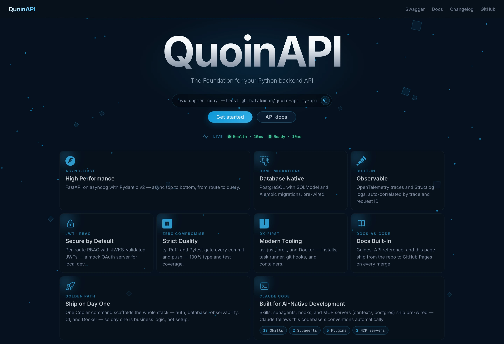

# Getting Started

Clone the project, start the stack, and make your first authenticated
request.

## Prerequisites

Ensure you have the following tools installed:

- **[Git](https://git-scm.com/)**: Version control system.
- **[Python 3.12+](https://www.python.org/downloads/)**: The programming
  language used.
- **[uv](https://github.com/astral-sh/uv)**: A fast Python package
  installer and manager.
- **[just](https://github.com/casey/just)**: A handy command runner for
  project tasks.
- **[Docker](https://www.docker.com/)**: Required for running the
  database and services.

## Quick Start

```bash
# 1. Clone the Repository
git clone https://github.com/balakmran/quoin-api.git
cd quoin-api

# 2. Configure Environment
cp .env.example .env

# 3. Setup Project (installs deps & git hooks)
just setup

# 4. Start DB + mock OAuth, Apply Migrations, and Run the Server
just dev
```

Visit [http://localhost:8000](http://localhost:8000) — the home page
confirms the app is up. API docs are at
[/docs](http://localhost:8000/docs) (Swagger UI) and
[/redoc](http://localhost:8000/redoc).



## Make an Authenticated Request

Every `/api/v1/` endpoint requires a bearer token. With `just dev`
running, mint one from the local mock OAuth server in a second terminal
and call a protected endpoint:

```bash
TOKEN=$(just token --roles="users.read,users.write")
curl -H "Authorization: Bearer $TOKEN" http://localhost:8000/api/v1/users/
```

Without the header the API answers `401`; with a token that lacks the
role, `403`. The [Authentication guide](authentication.md) covers how
tokens are validated and how to protect your own routes.

!!! note "Two development-only settings"
    `.env` (and the Compose stack) sets `QUOIN_OAUTH_ROLES_CLAIM=aud`,
    because the mock server puts roles there, and turns on the
    superuser bypass, so `just token --roles="api.superuser"` can call
    every endpoint. Neither is the default, and neither belongs in
    production; see [Deployment](deployment.md#environment-variables).

## Common Recipes

`just` is the task runner. The commands you'll reach for most:

| Command | What it does |
| :--- | :--- |
| `just setup` | Install deps and wire commit hooks — run once |
| `just dev` | Start Postgres, mock OAuth, apply migrations, and run the server |
| `just db` / `just oauth` | Start only Postgres, or only the mock OAuth server |
| `just new <module>` | Scaffold and register a complete DDD module |
| `just check` | Run format → lint → typecheck → migration check → test in one gate |
| `just migrate-gen "<msg>"` | Generate an Alembic migration from your model changes |
| `just token` | Mint a signed JWT against the local mock OAuth server |

!!! tip "Run `just --list` for the full menu."

## Project Structure

Understanding the project layout will help you navigate the codebase.

```plaintext
.
├── app/
│   ├── core/                   # Settings, security, errors, logging, middleware
│   ├── db/                     # Database session and base models
│   ├── http/                   # Shared outbound HTTP client
│   ├── modules/                # Domain-specific feature modules
│   │   ├── system/             # Health, readiness, and home-page routes
│   │   └── user/               # Example module to mirror
│   │       ├── exceptions.py   # Domain-specific exceptions
│   │       ├── models.py       # Database tables
│   │       ├── schemas.py      # Pydantic models
│   │       ├── repository.py   # CRUD operations
│   │       ├── routes.py       # API endpoints
│   │       └── service.py      # Business logic
│   ├── static/                 # Landing-page assets
│   ├── templates/              # Jinja2 templates (landing page)
│   ├── api.py                  # Router registration under /api/v1/
│   └── main.py                 # App factory
├── tests/                      # Integration tests against a real database
├── alembic/                    # Database migrations
├── docker-compose.yml          # Local development services
├── justfile                    # Task runner configuration
└── pyproject.toml              # Project dependencies and tool config
```

## What's Next?

Now that the app is running, here are the logical next steps:

| Task | Guide |
| :--- | :---- |
| Add a new feature module | [Creating a Module](creating-a-module.md) |
| Change environment settings | [Configuration](configuration.md) |
| Add a database column | [Database Migrations](database-migrations.md) |
| Write tests | [Testing](testing.md) |
| Explore the live API | [localhost:8000/docs](http://localhost:8000/docs) |
| Work with Claude Code | [AI-Assisted Development](ai-setup.md) |
| Fix something that won't start | [Troubleshooting](troubleshooting.md) |
