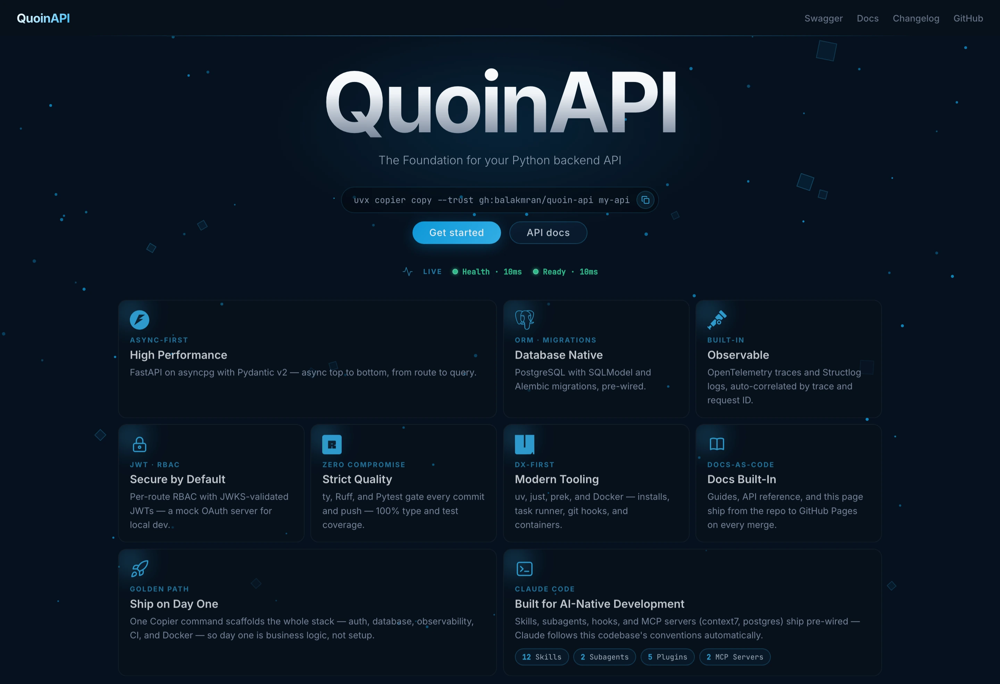

# Getting Started

Start the stack and make your first authenticated request.

## Prerequisites

[Git](https://git-scm.com/), [uv](https://docs.astral.sh/uv/) (it
installs Python 3.12+ for you), [just](https://github.com/casey/just),
and [Docker](https://www.docker.com/) for Postgres and the mock OAuth
server.

<!-- template-only -->

## Create Your Project

QuoinAPI is a [Copier](https://copier.readthedocs.io/) template: you
generate your own project from it rather than cloning it.

```bash
uvx copier copy --trust gh:balakmran/quoin-api my-api
cd my-api
git init    # the commit hooks need a repository
```

Copier asks for a project name, settings prefix, and author details,
then rewrites the project to match. Keep the name to 30 characters or
fewer. `--trust` lets the post-generation script run; read
`scripts/copier_setup.py.jinja` first if you want to see what it does.

To work on the template itself instead, see
[Contributing](../project/contributing.md).

<!-- /template-only -->

## Quick Start

From the project root:

```bash
cp .env.example .env   # development settings
just setup             # install dependencies and git hooks
just dev               # start Postgres + mock OAuth, migrate, serve
```

Visit [http://localhost:8000](http://localhost:8000) — the home page
confirms the app is up. API docs are at
[/docs](http://localhost:8000/docs) (Swagger UI) and
[/redoc](http://localhost:8000/redoc).



## Make an Authenticated Request

Every `/api/v1/` endpoint requires a bearer token. With `just dev`
running, mint one from the local mock OAuth server in a second terminal
and call a protected endpoint:

```bash
TOKEN=$(just token --roles="users.read,users.write")
curl -H "Authorization: Bearer $TOKEN" http://localhost:8000/api/v1/users/
```

Without the header the API answers `401`; with a token that lacks the
role, `403`. The [Authentication guide](authentication.md) covers how
tokens are validated and how to protect your own routes.

!!! note "Two development-only settings"
    `.env` (and the Compose stack) sets `QUOIN_OAUTH_ROLES_CLAIM=aud`,
    because the mock server puts roles there, and turns on the
    superuser bypass, so `just token --roles="api.superuser"` can call
    every endpoint. Neither is the default, and neither belongs in
    production; see [Deployment](deployment.md#environment-variables).

## Common Recipes

`just` runs every task. Quick Start and [What's Next?](#whats-next)
show the everyday commands; these fill the gaps:

| Command | What it does |
| :--- | :--- |
| `just db` / `just oauth` | Start only Postgres, or only the mock OAuth server |
| `just token --roles="..."` | Mint a signed JWT from the mock OAuth server |
| `just --list` | Show every recipe |

## Project Structure

Understanding the project layout will help you navigate the codebase.

```plaintext
.
├── app/
│   ├── core/                   # Settings, security, errors, logging, middleware
│   ├── db/                     # Database session and base models
│   ├── http/                   # Shared outbound HTTP client
│   ├── modules/                # Domain-specific feature modules
│   │   ├── system/             # Health, readiness, and home-page routes
│   │   └── user/               # Example module to mirror
│   │       ├── exceptions.py   # Domain-specific exceptions
│   │       ├── models.py       # Database tables
│   │       ├── schemas.py      # Pydantic models
│   │       ├── repository.py   # CRUD operations
│   │       ├── routes.py       # API endpoints
│   │       └── service.py      # Business logic
│   ├── static/                 # Landing-page assets
│   ├── templates/              # Jinja2 templates (landing page)
│   ├── api.py                  # Router registration under /api/v1/
│   └── main.py                 # App factory
├── tests/                      # Integration tests against a real database
├── alembic/                    # Database migrations
├── docker-compose.yml          # Local development services
├── justfile                    # Task runner configuration
└── pyproject.toml              # Project dependencies and tool config
```

## What's Next?

Replace the `user` example with your first real feature. Each step is
one command and one guide:

1. **Scaffold a module.** `just new product` creates every layer and
   registers the routes; fill them in with
   [Creating a Module](creating-a-module.md).
2. **Give it a table.** Add fields to `models.py`, import the model in
   `app/db/base.py`, then `just migrate-gen "add products"` and
   `just migrate-up`. See [Database Migrations](database-migrations.md).
3. **Protect its routes.** Add `require_roles("products.read")` to each
   route; a route without it is open to any caller. See
   [Authentication](authentication.md).
4. **Test it.** Drive the routes with `admin_client` against the real
   database. See [Testing](testing.md).
5. **Pass the gate.** `just check` runs what CI runs. See
   [Quality Checks](quality-checks.md).
6. **Ship it.** Build the image and run migrations as a job. See
   [Deployment](deployment.md).

Using Claude Code? Ask it to "add a product module" and the
`api-new-module` skill walks you through steps 1 to 5; see
[AI-Assisted Development](ai-setup.md).

Along the way:

- [Configuration](configuration.md) — every `QUOIN_` setting
- [Troubleshooting](troubleshooting.md) — when something won't start
- [Staying Current](staying-current.md) — taking a later template
  release
