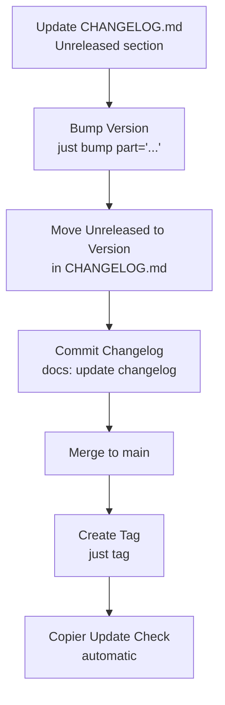

# Release Workflow

This guide covers version management, release tagging, and the changelog process.

## Semantic Versioning

We follow [Semantic Versioning (SemVer)](https://semver.org/) for all releases:

- **MAJOR** version (1.0.0 → 2.0.0) - Breaking changes
- **MINOR** version (1.0.0 → 1.1.0) - New features (backward compatible)
- **PATCH** version (1.0.0 → 1.0.1) - Bug fixes (backward compatible)

---

## Release Workflow Diagram

Visual overview of the complete release process:



---

## Release Process

### 1. Update CHANGELOG.md

Before bumping the version, document your changes in `CHANGELOG.md`:

```markdown
## [Unreleased]

### Added

- New user authentication endpoints

### Fixed

- Database connection pool timeout issue
```

Follow the [Keep a Changelog](https://keepachangelog.com/) format.

---

### 2. Bump Version

Increment the version number in `pyproject.toml` and `app/__init__.py`:

```bash
# For a patch release (0.1.0 → 0.1.1)
just bump

# For a minor release (0.1.0 → 0.2.0)
just bump minor

# For a major release (0.1.0 → 1.0.0)
just bump major
```

This command automatically:

- Updates version in `pyproject.toml`
- Updates `__version__` in `app/__init__.py`

---

### 3. Update Changelog Version

Move the `[Unreleased]` section to the new version:

```markdown
## [1.2.0] - 2026-02-15

### Added

- New user authentication endpoints

### Fixed

- Database connection pool timeout issue

## [Unreleased]

(Empty - next development cycle)
```

Commit this change:

```bash
git add CHANGELOG.md
git commit -m "docs: update changelog for v1.2.0"
```

---

### 4. Create Release Tag

After merging the version bump to `main`, create and push a Git tag:

```bash
just tag
```

This command:

1. Creates a Git tag (e.g., `v1.2.0`)
2. Pushes the tag to the remote repository
3. Triggers the [Copier Update Check](#6-copier-update-verification-automatic)
   workflow

---

### 5. GitHub Release

Pushing the tag does **not** create a GitHub Release automatically —
there is no workflow for it. If you want one, create it yourself once
the tag is pushed:

```bash
gh release create v1.2.0 --title v1.2.0 --notes-from-tag
```

Or use `--notes-file` to paste in the relevant `CHANGELOG.md` section
instead of GitHub's auto-generated notes. Either way, the tag itself
(not a GitHub Release) is what `copier copy`, `copier update`, and
`just verify-template-update` resolve against.

View tags at:
[https://github.com/balakmran/quoin-api/tags](https://github.com/balakmran/quoin-api/tags)

---

### 6. Copier Update Verification (automatic)

Pushing a `v*` tag also triggers the **Copier Update Check** workflow
(`.github/workflows/copier-update.yml`). It generates a project from the
previous release tag, runs `copier update` to the tag just pushed, and
fails the job if the update leaves `.rej` conflict files or the
generated project's `.copier-answers.yml` doesn't end up pointing at the
new tag. On the very first release (no earlier tag exists) the job is a
no-op.

This only checks that the *update mechanism* itself still works — it
does not run `just check` against the generated project. Whether a
freshly generated (or updated) scaffold passes `just check` out of the
box is tracked separately as template completeness work (see
`ROADMAP.md`).

You can run the same check locally before tagging:

```bash
just verify-template-update v0.8.0 v0.9.0
```

---

## Conventional Commits

Use [Conventional Commits](https://www.conventionalcommits.org/) for clear
commit history:

| Type        | Description           | Changelog Section |
| ----------- | --------------------- | ----------------- |
| `feat:`     | New feature           | Added             |
| `fix:`      | Bug fix               | Fixed             |
| `docs:`     | Documentation changes | Changed           |
| `style:`    | Code formatting       | -                 |
| `refactor:` | Code refactoring      | Changed           |
| `test:`     | Test updates          | -                 |
| `chore:`    | Build/tooling changes | -                 |

**Examples:**

```bash
git commit -m "feat(user): add password reset endpoint"
git commit -m "fix(db): resolve connection pool timeout"
git commit -m "docs: update deployment guide"
```

---

## Release Checklist

Before creating a release:

- [ ] All tests pass (`just check`)
- [ ] No known CVEs in the locked dependencies (`just audit`) — see
      [Dependency Scanning](dependency-scanning.md#uv-audit)
- [ ] `CHANGELOG.md` is updated with all changes
- [ ] Version is bumped (`just bump part="..."`)
- [ ] Changes are merged to `main` branch
- [ ] Tag is created and pushed (`just tag`)
- [ ] Copier Update Check passes on the new tag (automatic; see
      [above](#6-copier-update-verification-automatic))
- [ ] GitHub Release is created, if desired (`gh release create`; not
      automatic)
- [ ] Documentation is deployed

---

## Hotfix Releases

For critical bug fixes that need immediate release:

1. **Create hotfix branch** from `main`:

   ```bash
   git checkout -b hotfix/critical-bug-fix main
   ```

2. **Fix the bug** and commit:

   ```bash
   git commit -m "fix: resolve critical security issue"
   ```

3. **Bump patch version**:

   ```bash
   just bump
   ```

4. **Update changelog**, commit, and merge to `main`

5. **Create tag**:
   ```bash
   just tag
   ```

---

## Pre-releases

For beta or release candidate versions:

```bash
# Manual version bump (not automated by just)
# In pyproject.toml and app/__init__.py
__version__ = "1.2.0-beta.1"

# Create pre-release tag
git tag v1.2.0-beta.1
git push origin v1.2.0-beta.1
```

Mark as "Pre-release" in GitHub when creating the release.

---

## See Also

- [Deployment Guide](deployment.md) — Deploying releases to production
- [Conventional Commits](https://www.conventionalcommits.org/) — Commit message format
- [Semantic Versioning](https://semver.org/) — Version numbering scheme
- [justfile](https://github.com/balakmran/quoin-api/blob/main/justfile) — Automation commands
