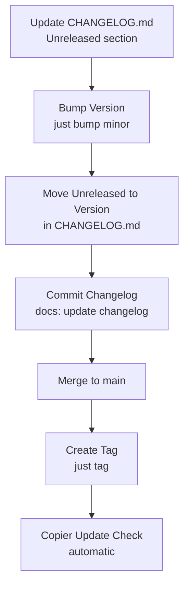

# Release Workflow

This guide covers version management, release tagging, and the changelog process.

## Semantic Versioning

We follow [Semantic Versioning (SemVer)](https://semver.org/) for all releases:

- **MAJOR** version (1.0.0 → 2.0.0) - Breaking changes
- **MINOR** version (1.0.0 → 1.1.0) - New features (backward compatible)
- **PATCH** version (1.0.0 → 1.0.1) - Bug fixes (backward compatible)

---

## Release Workflow Diagram

Visual overview of the complete release process:


```mermaid
graph TD
    A[Update CHANGELOG.md<br/>Unreleased section] --> B[Bump Version<br/>just bump minor]
    B --> C[Move Unreleased to Version<br/>in CHANGELOG.md]
    C --> D[Commit Changelog<br/>docs: update changelog]
    D --> E[Merge to main]
    E --> F[Create Tag<br/>just tag]
    F --> G[Copier Update Check<br/>automatic]
```

---

## Release Process

### 1. Update CHANGELOG.md

Before bumping the version, document your changes in `CHANGELOG.md`:

```markdown
## [Unreleased]

### Added

- New user authentication endpoints

### Fixed

- Database connection pool timeout issue
```

Follow the [Keep a Changelog](https://keepachangelog.com/) format.

---

### 2. Bump Version

Increment the version number in `pyproject.toml` and `app/__init__.py`:

```bash
# For a patch release (0.1.0 → 0.1.1)
just bump

# For a minor release (0.1.0 → 0.2.0)
just bump minor

# For a major release (0.1.0 → 1.0.0)
just bump major
```

This command automatically:

- Updates version in `pyproject.toml`
- Updates `__version__` in `app/__init__.py`

It refuses to run if the two files disagree. For release candidates, see
[Pre-releases](#pre-releases).

---

### 3. Update Changelog Version

Move the `[Unreleased]` section to the new version:

```markdown
## [1.2.0] - 2026-02-15

### Added

- New user authentication endpoints

### Fixed

- Database connection pool timeout issue

## [Unreleased]

(Empty - next development cycle)
```

Commit this change:

```bash
git add CHANGELOG.md
git commit -m "docs: update changelog for v1.2.0"
```

---

### 4. Create Release Tag

After merging the version bump to `main`, create and push a Git tag:

```bash
just tag
```

This command:

1. Creates a Git tag (e.g., `v1.2.0`)
2. Pushes the tag to the remote repository
3. Publishes the GitHub Release, using that version's `CHANGELOG.md`
   section as the body
4. Triggers the [Copier Update Check](#6-copier-update-verification-automatic)
   workflow

Both halves are idempotent, so re-running after a partial failure is
safe: an existing tag is not recreated, and an existing release is left
alone rather than aborting the run.

---

### 5. GitHub Release

Step 4 already published it — no workflow does this, so `just tag` is
what creates it. The release is titled with the bare tag and its body is
the version's `CHANGELOG.md` section, which is the convention every
release since `v0.8.0` follows.

`gh` must be installed and authenticated. It is checked *before* the tag
is created, so a missing prerequisite costs nothing rather than leaving
a pushed tag with no release:

```bash
just tag --no-release   # tag only; needs no gh
```

If the release step fails after the tag is pushed, **don't delete the
tag** — fix the problem and re-run `just tag`, which skips the existing
tag and retries only the release. To correct a published release's
notes, edit it in place with
`gh release edit v1.2.0 --notes-file -`.

The tag itself (not the GitHub Release) is what `copier copy`,
`copier update`, and `just verify-template-update` resolve against.

View tags at:
[https://github.com/balakmran/quoin-api/tags](https://github.com/balakmran/quoin-api/tags)

---

### 6. Copier Update Verification (automatic)

Pushing a `v*` tag also triggers the **Copier Update Check** workflow
(`.github/workflows/copier-update.yml`). It generates a project from the
previous release tag, runs `copier update` to the tag just pushed, and
then runs the updated project's own `just check` against a Postgres
service. The job fails if any of these happen:

- The update leaves `.rej` conflict files.
- The project's `.copier-answers.yml` doesn't end up pointing at the new
  tag.
- The updated project's own gate fails.

On the very first release (no earlier tag exists) the job is a no-op.
Release candidates sort below their final release when the job picks the
previous tag; see [Pre-releases](#pre-releases).

This covers the *update* path. A *freshly generated* project is gated
separately, on every pull request, by the **Scaffold Smoke Test**. See
[Quality Checks](quality-checks.md#ci-integration).

You can run the same check locally before tagging:

```bash
just verify-template-update v0.8.0 v0.9.0 --check
```

---

## Conventional Commits

Use [Conventional Commits](https://www.conventionalcommits.org/) for clear
commit history:

| Type        | Description           | Changelog Section |
| ----------- | --------------------- | ----------------- |
| `feat:`     | New feature           | Added             |
| `fix:`      | Bug fix               | Fixed             |
| `docs:`     | Documentation changes | Changed           |
| `style:`    | Code formatting       | -                 |
| `refactor:` | Code refactoring      | Changed           |
| `test:`     | Test updates          | -                 |
| `chore:`    | Build/tooling changes | -                 |

**Examples:**

```bash
git commit -m "feat(user): add password reset endpoint"
git commit -m "fix(db): resolve connection pool timeout"
git commit -m "docs: update deployment guide"
```

---

## Release Checklist

Before creating a release:

- [ ] All tests pass (`just check`)
- [ ] No known CVEs in the locked dependencies (`just audit`) — see
      [Dependency Scanning](dependency-scanning.md#uv-audit)
- [ ] `CHANGELOG.md` is updated with all changes
- [ ] Version is bumped (`just bump <part>`)
- [ ] Changes are merged to `main` branch
- [ ] Tag is pushed and the GitHub Release is published (`just tag`)
- [ ] Copier Update Check passes on the new tag (automatic; see
      [above](#6-copier-update-verification-automatic))
- [ ] Documentation is deployed

---

## Hotfix Releases

For critical bug fixes that need immediate release:

1. **Create hotfix branch** from `main`:

   ```bash
   git checkout -b hotfix/critical-bug-fix main
   ```

2. **Fix the bug** and commit:

   ```bash
   git commit -m "fix: resolve critical security issue"
   ```

3. **Bump patch version**:

   ```bash
   just bump
   ```

4. **Update changelog**, commit, and merge to `main`

5. **Create tag**:
   ```bash
   just tag
   ```

---

## Pre-releases

Release candidates use the `X.Y.Z-rc.N` form and go through the same
bump → changelog → merge → tag flow as any other release. Other
pre-release labels (`-beta.N`, `-alpha.N`) are not supported.

```bash
just bump major --rc   # 0.14.0 → 1.0.0-rc.1 (also minor/patch --rc)
just bump rc           # 1.0.0-rc.1 → 1.0.0-rc.2
just bump release      # 1.0.0-rc.2 → 1.0.0
```

From a candidate, `major`, `minor`, and `patch` are refused, so
`1.0.0-rc.2` cannot become `2.0.0` by accident.

Each candidate gets its own changelog section (`## [1.0.0-rc.1] -
YYYY-MM-DD`). `just tag` then tags `v1.0.0-rc.1` and publishes it as a
GitHub **pre-release**, which GitHub never marks as the latest release.

The Copier Update Check sorts candidates below their final release. So
`v1.0.0-rc.1` verifies its update from the previous final tag,
`v1.0.0` verifies from the last candidate, and `v1.0.1` verifies from
`v1.0.0`.

---

## See Also

- [Deployment Guide](deployment.md) — Deploying releases to production
- [Conventional Commits](https://www.conventionalcommits.org/) — Commit message format
- [Semantic Versioning](https://semver.org/) — Version numbering scheme
- [justfile](https://github.com/balakmran/quoin-api/blob/main/justfile) — Automation commands
